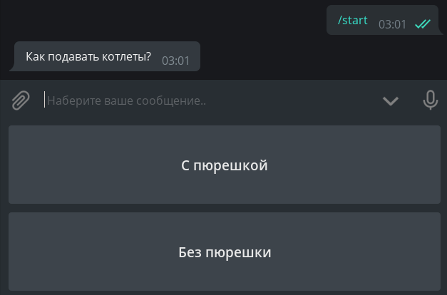
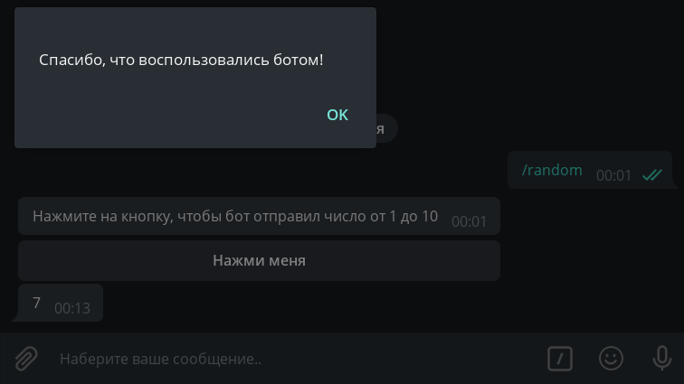

# Кнопки

В этой главе мы познакомимся с такой замечательной фичей Telegram-ботов, как кнопки. Прежде всего, чтобы избежать 
путаницы, определимся с названиями. То, что цепляется к низу экрана вашего устройства, будем называть **обычными** 
кнопками, а то, что цепляется непосредственно к сообщениям, назовём **инлайн**-кнопками. Ещё раз картинкой:  


## Обычные кнопки {: id="reply-buttons" }
### Кнопки как шаблоны {: id="reply-as-text" }

Этот вид кнопок появился вместе с Bot API в далёком 2015 году и представляет собой не что иное, как шаблоны сообщений 
(за исключением нескольких особых случаев, но о них позже). Принцип простой: что написано на кнопке, то и будет отправлено 
в текущий чат. Соответственно, чтобы обработать нажатие такой кнопки, бот должен распознавать входящие текстовые сообщения. 

Напишем хэндлер, который будет при нажатии на команду `/start` отправлять сообщение с двумя кнопками:

```python
# from aiogram import types
@dp.message_handler(commands="start")
async def cmd_start(message: types.Message):
    keyboard = types.ReplyKeyboardMarkup()
    button_1 = types.KeyboardButton(text="С пюрешкой")
    keyboard.add(button_1)
    button_2 = "Без пюрешки"
    keyboard.add(button_2)
    await message.answer("Как подавать котлеты?", reply_markup=keyboard)
```

Обратите внимание, что т.к. обычные кнопки суть шаблоны сообщений, то их можно создавать не только как объекты `KeyboardButton`, 
но и как обычные строки.  
Что ж, запустим бота и обалдеем от громадных кнопок:



Как-то некрасиво. Во-первых, хочется сделать кнопки поменьше, а во-вторых, расположить их горизонтально.  
Почему вообще они такие большие? Дело в том, что по умолчанию «кнопочная» клавиатура должна занимать на смартфонах столько 
же места, сколько и обычная буквенная. Для уменьшения кнопок к объекту клавиатуры надо указать дополнительный 
параметр `resize_keyboard=True`.  
Но как заменить вертикальные кнопки на горизонтальные? С точки зрения Bot API, клавиатура — это [массив массивов](https://core.telegram.org/bots/api#replykeyboardmarkup) 
кнопок, а если говорить проще, массив строк. Метод `add()` при каждом вызове создаёт новую строку (ряд) и принимает 
произвольное число аргументов по количеству желаемых кнопок в строке. Перепишем наш код, чтобы было красиво:

```python
@dp.message_handler(commands="start")
async def cmd_start(message: types.Message):
    keyboard = types.ReplyKeyboardMarkup(resize_keyboard=True)
    buttons = ["С пюрешкой", "Без пюрешки"]
    keyboard.add(*buttons)
    await message.answer("Как подавать котлеты?", reply_markup=keyboard)
```

!!! info ""
    Обратите внимание на конструкцию `*buttons`. Здесь вам не C++ и звёздочка используется для _распаковки списка_. 
    Подробнее об операторах `*` и `**` можно прочитать 
    [здесь](https://tproger.ru/translations/asterisks-in-python-what-they-are-and-how-to-use-them/).

Смотрим — действительно красиво:


Осталось научить бота реагировать на нажатие таких кнопок. Как уже было сказано выше, необходимо делать проверку 
на полное совпадение текста. Сделаем это двумя способами: через специальный фильтр `Text` и обычной лямбдой:

```python
# from aiogram.dispatcher.filters import Text
@dp.message_handler(Text(equals="С пюрешкой"))
async def with_puree(message: types.Message):
    await message.reply("Отличный выбор!")


@dp.message_handler(lambda message: message.text == "Без пюрешки")
async def without_puree(message: types.Message):
    await message.reply("Так невкусно!")
```


Чтобы удалить кнопки, необходимо отправить новое сообщение со специальной «удаляющей» клавиатурой типа 
`ReplyKeyboardRemove`. Например: `await message.reply("Отличный выбор!", reply_markup=types.ReplyKeyboardRemove())`

!!! info ""
    У [объекта обычной клавиатуры](https://core.telegram.org/bots/api#replykeyboardmarkup) есть ещё две полезных опции: 
    `one_time_keyboard` для скрытия кнопок после нажатия и `selective` для показа клавиатуры лишь некоторым участникам группы. 
    Их использование остаётся для самостоятельного изучения.

    Помимо стандартных опций, описанных выше, aiogram немного расширяет функциональность клавиатур параметром `row_width`. 
    При его использовании, фреймворк автоматически разобьёт массив кнопок на строки по N элементов в каждой, где N — 
    значение `row_width`, например, `row_width=2`. Попробуйте!

### Специальные обычные кнопки {: id="reply-special" }

По состоянию на конец ужасного 2020 года в Telegram существует три специальных вида обычных кнопок, не являющихся шаблонами: 
для отправки текущей геолокации, для отправки своего номера телефона и ярлык для создания опроса/викторины. Для первых двух 
типов достаточно установить булевый флаг, а для опросов и викторин нужно передать специальный тип `KeyboardButtonPollType` 
и, по желанию, указать тип создаваемого объекта.

Впрочем, проще один раз увидеть код:
```python
@dp.message_handler(commands="special_buttons")
async def cmd_special_buttons(message: types.Message):
    keyboard = types.ReplyKeyboardMarkup(resize_keyboard=True)
    keyboard.add(types.KeyboardButton(text="Запросить геолокацию", request_location=True))
    keyboard.add(types.KeyboardButton(text="Запросить контакт", request_contact=True))
    keyboard.add(types.KeyboardButton(text="Создать викторину",
                                      request_poll=types.KeyboardButtonPollType(type=types.PollType.QUIZ)))
    await message.answer("Выберите действие:", reply_markup=keyboard)
```

## Инлайн-кнопки {: id="inline-buttons" }
### URL-кнопки и колбэки {: id="url-callback-buttons" }

В отличие от обычных кнопок, инлайновые цепляются не к низу экрана, а к сообщению, с которым были отправлены. 
В этой главе мы рассмотрим два типа таких кнопок: URL и Callback. Ещё один — Switch — будет рассмотрен 
в главе про [инлайн-режим](inline_mode.md).

!!! info ""
    Login- и Pay-кнопки в книге рассматриваться не будут вообще. Если у кого-то есть желание помочь хотя бы 
    с рабочим кодом для авторизации или оплаты, пожалуйста, создайте Pull Request на 
    [GitHub](https://github.com/MasterGroosha/aiogram-2-guide). Спасибо!

Самые простые инлайн-кнопки относятся к типу URL, т.е. «ссылка». Поддерживаются только протоколы HTTP(S) и tg://

```python
@dp.message_handler(commands="inline_url")
async def cmd_inline_url(message: types.Message):
    buttons = [
        types.InlineKeyboardButton(text="GitHub", url="https://github.com"),
        types.InlineKeyboardButton(text="Оф. канал Telegram", url="tg://resolve?domain=telegram")
    ]
    keyboard = types.InlineKeyboardMarkup(row_width=1)
    keyboard.add(*buttons)
    await message.answer("Кнопки-ссылки", reply_markup=keyboard)
```

А если хотите обе кнопки в ряд, то уберите `row_width=1` (тогда будет использоваться значение по умолчанию 3).

С URL-кнопками больше обсуждать, по сути, нечего, поэтому перейдём к гвоздю сегодняшней программы — Callback-кнопкам. 
Это очень мощная штука, которую вы можете встретить практически везде. Кнопки-реакции у постов (лайки), меню у @BotFather 
и т.д. Суть в чём: у колбэк-кнопок есть специальное значение (data), по которому ваше приложение опознаёт, что нажато и что надо сделать. 
И выбор правильного data **очень важен**! Стоит также отметить, что, в отличие от обычных кнопок, нажатие на колбэк-кнопку 
позволяет сделать практически что угодно, от заказа пиццы до перезагрузки сервера.

Напишем хэндлер, который по команде `/random` будет отправлять сообщение с колбэк-кнопкой:
```python
@dp.message_handler(commands="random")
async def cmd_random(message: types.Message):
    keyboard = types.InlineKeyboardMarkup()
    keyboard.add(types.InlineKeyboardButton(text="Нажми меня", callback_data="random_value"))
    await message.answer("Нажмите на кнопку, чтобы бот отправил число от 1 до 10", reply_markup=keyboard)
```

Но как же обработать нажатие? Если раньше мы использовали `message_handler` для обработки входящих сообщений, то теперь 
будем использовать `callback_query_handler` для обработки колбэков. Ориентироваться будем на «значение» кнопки, т.е. на 
её data:

```python
@dp.callback_query_handler(text="random_value")
async def send_random_value(call: types.CallbackQuery):
    await call.message.answer(str(randint(1, 10)))
```

!!! warning "Важно"
    Несмотря на то, что параметр кнопки `callback_data`, а значение `data` лежит в одноимённом поле `data` 
    объекта [CallbackQuery](https://core.telegram.org/bots/api#callbackquery), собственный фильтр aiogram называется `text`.
 


Ой, а что это за часики? Оказывается, сервер Telegram ждёт от нас подтверждения о доставке колбэка, иначе в течение 30 
секунд будет показывать специальную иконку. Чтобы скрыть часики, нужно вызвать метод `answer()` у колбэка (или использовать 
метод API `answer_callback_query()`). В общем случае, в метод `answer()` можно ничего не передавать, но можно вызвать 
специальное окошко (всплывающее сверху или поверх экрана):

```python
@dp.callback_query_handler(text="random_value")
async def send_random_value(call: types.CallbackQuery):
    await call.message.answer(str(randint(1, 10)))
    await call.answer(text="Спасибо, что воспользовались ботом!", show_alert=True)
    # или просто await call.answer()
```




!!! info "Обратите внимание"
    В функции `send_random_value` мы вызывали метод `answer()` не у `message`, а у `call.message`. Это связано с тем, 
    что колбэк-хэндлеры работают не с сообщениями (тип [Message](https://core.telegram.org/bots/api#message)), 
    а с колбэками (тип [CallbackQuery](https://core.telegram.org/bots/api#callbackquery)), у которого другие поля, и 
    само сообщение — всего лишь его часть. Учтите также, что `message` — это сообщение, к которому была прицеплена 
    кнопка (т.е. отправитель такого сообщения — сам бот). Если хотите узнать, кто нажал на кнопку, смотрите 
    поле `from` (в вашем коде это будет `call.from_user`, т.к. слово `from` зарезервировано в Python)

!!! question "Когда вызывать `answer()`?"
    В общем случае, главное — просто не забыть сообщить Telegram о получении колбэк-запроса, но я рекомендую ставить 
    вызов `answer()` в самом конце, и вот почему: если вдруг в процессе обработки колбэка случится какая-то ошибка и 
    бот нарвётся на необработанное исключение, пользователь увидит неубирающиеся полминуты часики и поймёт, что что-то 
    не так. В противном случае, часики исчезнут, а пользователь останется в неведении, выполнился его запрос успешно или нет.


Перейдём к примеру посложнее. Пусть пользователю предлагается сообщение с числом 0, а внизу три кнопки: +1, -1 и Подтвердить. 
Первыми двумя он может редактировать число, а последняя удаляет всю клавиатуру, фиксируя изменения. Хранить значения будем 
в памяти в словаре (про конечные автоматы поговорим как-нибудь _в другой раз_).

```python
# Здесь хранятся пользовательские данные.
# Т.к. это словарь в памяти, то при перезапуске он очистится
user_data = {}

def get_keyboard():
    # Генерация клавиатуры.
    buttons = [
        types.InlineKeyboardButton(text="-1", callback_data="num_decr"),
        types.InlineKeyboardButton(text="+1", callback_data="num_incr"),
        types.InlineKeyboardButton(text="Подтвердить", callback_data="num_finish")
    ]
    # Благодаря row_width=2, в первом ряду будет две кнопки, а оставшаяся одна
    # уйдёт на следующую строку
    keyboard = types.InlineKeyboardMarkup(row_width=2)
    keyboard.add(*buttons)
    return keyboard

async def update_num_text(message: types.Message, new_value: int):
    # Общая функция для обновления текста с отправкой той же клавиатуры
    await message.edit_text(f"Укажите число: {new_value}", reply_markup=get_keyboard())

@dp.message_handler(commands="numbers")
async def cmd_numbers(message: types.Message):
    user_data[message.from_user.id] = 0
    await message.answer("Укажите число: 0", reply_markup=get_keyboard())

@dp.callback_query_handler(Text(startswith="num_"))
async def callbacks_num(call: types.CallbackQuery):
    # Получаем текущее значение для пользователя, либо считаем его равным 0
    user_value = user_data.get(call.from_user.id, 0)
    # Парсим строку и извлекаем действие, например `num_incr` -> `incr`
    action = call.data.split("_")[1]
    if action == "incr":
        user_data[call.from_user.id] = user_value+1
        await update_num_text(call.message, user_value+1)
    elif action == "decr":
        user_data[call.from_user.id] = user_value-1
        await update_num_text(call.message, user_value-1)
    elif action == "finish":
        # Если бы мы не меняли сообщение, то можно было бы просто удалить клавиатуру
        # вызовом await call.message.delete_reply_markup().
        # Но т.к. мы редактируем сообщение и не отправляем новую клавиатуру, 
        # то она будет удалена и так.
        await call.message.edit_text(f"Итого: {user_value}")
    # Не забываем отчитаться о получении колбэка
    await call.answer()
```

И, казалось бы, всё работает: 


Но теперь представим, что ушлый пользователь сделал следующее: вызвал команду `/numbers` (значение 0), увеличил значение 
до 1, снова вызвал `/numbers` (значение сбросилось до 0) и отредактировал нажал кнопку "+1" на первом сообщении. 
Что произойдёт? Бот по-честному отправит запрос на редактирование текста со значением 1, но т.к. на том сообщении 
уже стоит цифра 1, то Bot API вернёт ошибку, что старый и новый тексты совпадают, а бот словит исключение: 
`aiogram.utils.exceptions.MessageNotModified: Message is not modified: specified new message content and reply markup 
are exactly the same as a current content and reply markup of the message`


С этой ошибкой вы, скорее всего, будете поначалу часто сталкиваться, пытаясь редактировать сообщения. Но, в действительности, 
решается проблема очень просто: мы проигнорируем исключение `MessageNotModified`. Из [первой главы](quickstart.md#_3) вы 
уже знаете о такой прекрасной штуке, как `errors_handler`, но в этот раз мы поступим чуть иначе и перепишем 
функцию `update_num_text()` следующим образом:

```python
# from aiogram.utils.exceptions import MessageNotModified
# from contextlib import suppress

async def update_num_text(message: types.Message, new_value: int):
    with suppress(MessageNotModified):
        await message.edit_text(f"Укажите число: {new_value}", reply_markup=get_keyboard())
```

Если теперь вы попробуете повторить пример выше, то указанное исключение в этом блоке кода бот просто-напросто проигнорирует.

### Фабрика колбэков {: id="callback-factory" }

В aiogram существует т.н. фабрика колбэков. Вы создаёте объект `CallbackData`, указываете ему префикс и произвольное 
количество доп. аргументов, которые в дальнейшем указываете при создании колбэка для кнопки.  
Например, рассмотрим следующий объект:
```python
# from aiogram.utils.callback_data import CallbackData
cb= CallbackData("post", "id", "action")
```
Тогда при создании кнопки вам надо указать её параметры так:
```python
button =  types.InlineKeyboardButton(
    text="Лайкнуть", 
    callback_data=cb.new(id=5, action="like")
)
```

В примере выше в кнопку запишется `callback_data`, равный `post:5:like`, а хэндлер на префикс `post` будет выглядеть так:
```python
@dp.callback_query_handler(cb.filter())
async def callbacks(call: types.CallbackQuery, callback_data: dict):
    post_id = callback_data["id"]
    action = callback_data["action"]
```

В предыдущем примере с числами мы грамотно выбрали `callback_data`, поэтому смогли легко запихнуть все обработчики 
в один хэндлер. Но можно логически разнести обработку инкремента и декремента от обработки нажатия на кнопку "Подтвердить". 
Для этого в фильтре фабрики можно указать желаемые значения какого-либо параметра. Давайте перепишем наш пример 
с использоваанием фабрики:

```python
# fabnum - префикс, action - название аргумента, которым будем передавать значение
callback_numbers = CallbackData("fabnum", "action")


def get_keyboard_fab():
    buttons = [
        types.InlineKeyboardButton(text="-1", callback_data=callback_numbers.new(action="decr")),
        types.InlineKeyboardButton(text="+1", callback_data=callback_numbers.new(action="incr")),
        types.InlineKeyboardButton(text="Подтвердить", callback_data=callback_numbers.new(action="finish"))
    ]
    keyboard = types.InlineKeyboardMarkup(row_width=2)
    keyboard.add(*buttons)
    return keyboard


async def update_num_text_fab(message: types.Message, new_value: int):
    with suppress(MessageNotModified):
        await message.edit_text(f"Укажите число: {new_value}", reply_markup=get_keyboard_fab())


@dp.message_handler(commands="numbers_fab")
async def cmd_numbers(message: types.Message):
    user_data[message.from_user.id] = 0
    await message.answer("Укажите число: 0", reply_markup=get_keyboard_fab())


@dp.callback_query_handler(callback_numbers.filter(action=["incr", "decr"]))
async def callbacks_num_change_fab(call: types.CallbackQuery, callback_data: dict):
    user_value = user_data.get(call.from_user.id, 0)
    action = callback_data["action"]
    if action == "incr":
        user_data[call.from_user.id] = user_value + 1
        await update_num_text_fab(call.message, user_value + 1)
    elif action == "decr":
        user_data[call.from_user.id] = user_value - 1
        await update_num_text_fab(call.message, user_value - 1)
    await call.answer()


@dp.callback_query_handler(callback_numbers.filter(action=["finish"]))
async def callbacks_num_finish_fab(call: types.CallbackQuery):
    user_value = user_data.get(call.from_user.id, 0)
    await call.message.edit_text(f"Итого: {user_value}")
    await call.answer()
```

На этом глава про кнопки окончена, но про некоторые других их виды мы поговорим в следующих главах.