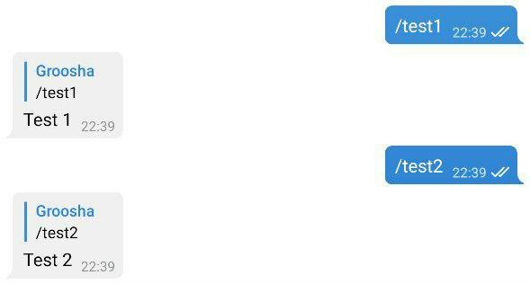

# Знакомство с aiogram

!!! tip "Старая версия aiogram"
    Для aiogram 3.x эта глава расположена [здесь](https://mastergroosha.github.io/aiogram-3-guide/quickstart/).

## Установка {: id="installation" }

Для начала давайте создадим каталог для бота, организуем там virtual environment (далее venv) и
установим библиотеку [aiogram](https://github.com/aiogram/aiogram).  
Проверим, что установлен Python версии 3.7 (если вы знаете, что установлен 3.8 и выше, можете пропустить этот кусок):

```plain
[groosha@main lesson_01]$ python3.7
Python 3.7.6 (default, Apr 27 2020, 00:17:38) 
[GCC 9.3.0] on linux
Type "help", "copyright", "credits" or "license" for more information.
>>> exit()
[groosha@main lesson_01]$ 
```

Теперь создадим файл `requirements.txt`, в котором укажем используемую нами версию aiogram.
!!! important "О версиях aiogram"
    В этой главе используется aiogram версии **2.9.2**, но перед началом работы рекомендую заглянуть в 
    [канал релизов](https://t.me/aiogram_live) библиотеки и проверить наличие более новой версии. Подойдёт любая 
    более новая, начинающаяся с цифры 2, поскольку в будущем ожидается релиз aiogram 3.0 с заметными изменениями 
    и без обратной совместимости.  
    Чтобы избежать неприятностей, зафиксируемся на 2.9.2 и далее будем обновляться вручную.

```plain
[groosha@main lesson_01]$ python3.7 -m venv venv
[groosha@main lesson_01]$ echo "aiogram==2.9.2" > requirements.txt 
[groosha@main lesson_01]$ source venv/bin/activate
(venv) [groosha@main lesson_01]$ pip install -r requirements.txt
# ...здесь куча строк про установку...
Successfully installed Babel-2.8.0 aiogram-2.9.2 aiohttp-3.6.2 async-timeout-3.0.1 attrs-19.3.0 certifi-2020.6.20 chardet-3.0.4 idna-2.10 multidict-4.7.6 pytz-2020.1 typing-extensions-3.7.4.2 yarl-1.5.1
WARNING: You are using pip version 19.2.3, however version 20.2.1 is available.
You should consider upgrading via the 'pip install --upgrade pip' command.
(venv) [groosha@main lesson_01]$ 
```

Обратите внимание на префикс "venv" в терминале. Он указывает, что мы находимся в виртуальном окружении с именем "venv".
Проверим, что внутри venv вызов команды `python` указывает на всё тот же Python 3.7:  
```plain
(venv) [groosha@main lesson_01]$ python
Python 3.7.6 (default, Apr 27 2020, 00:17:38) 
[GCC 9.3.0] on linux
Type "help", "copyright", "credits" or "license" for more information.
>>> exit()
(venv) [groosha@main lesson_01]$ deactivate 
[groosha@main lesson_01]$ 
```

Последней командой `deactivate` мы вышли из venv, чтобы он нам не мешал. 

## Первый бот {: id="hello-world" }

Давайте создадим файл `bot.py` с базовым шаблоном бота на aiogram:
```python
#!venv/bin/python
import logging
from aiogram import Bot, Dispatcher, executor, types

# Объект бота
bot = Bot(token="12345678:AaBbCcDdEeFfGgHh")
# Диспетчер для бота
dp = Dispatcher(bot)
# Включаем логирование, чтобы не пропустить важные сообщения
logging.basicConfig(level=logging.INFO)


# Хэндлер на команду /test1
@dp.message_handler(commands="test1")
async def cmd_test1(message: types.Message):
    await message.reply("Test 1")


if __name__ == "__main__":
    # Запуск бота
    executor.start_polling(dp, skip_updates=True)
```

Первое, на что нужно обратить внимание: aiogram — асинхронная библиотека, поэтому ваши функции тоже должны быть асинхронными, 
а перед вызовами методов API нужно ставить ключевое слово **await**, т.к. эти вызовы возвращают [корутины](https://docs.python.org/3/library/asyncio-task.html#coroutines).

!!! info "Асинхронное программирование в Python"
    Не стоит пренебрегать официальной документацией!  
    Прекрасный туториал по asyncio доступен [на сайте Python](https://docs.python.org/3/library/asyncio-task.html).

Если вы в прошлом работали с какой-то другой библиотекой для Telegram, например, pyTelegramBotAPI, то концепция
хэндлеров (обработчиков событий) вам сразу станет понятна, разница лишь в том, что в aiogram хэндлерами управляет диспетчер.  
Диспетчер регистрирует функции-обработчики, дополнительно ограничивая перечень вызывающих их событий через фильтры. 
После получения очередного апдейта (события от Telegram), диспетчер выберет нужную функцию обработки, подходящую по всем 
фильтрам, например, «обработка сообщений, являющихся изображениями, в чате с ID икс и с длиной подписи игрек». Если две 
функции имеют одинаковые по логике фильтры, то будет вызвана та, что зарегистрирована раньше.

Чтобы зарегистрировать функцию как обработчик сообщений, нужно сделать одно из двух действий:  
1. Навесить на неё [декоратор](https://devpractice.ru/python-lesson-19-decorators/), как в примере выше. 
С различными типами декораторов мы познакомимся позднее.
2. Напрямую вызвать метод регистрации у диспетчера.

Рассмотрим следующий код: 
```python
# Хэндлер на команду /test1
@dp.message_handler(commands="test1")
async def cmd_test1(message: types.Message):
    await message.reply("Test 1")

# Хэндлер на команду /test2
async def cmd_test2(message: types.Message):
    await message.reply("Test 2")
```

Давайте запустим с ним бота:  


Функция `cmd_test2` не работает, т.к. диспетчер о ней не знает. Исправим эту ошибку 
и отдельно зарегистрируем функцию:
```python
# Хэндлер на команду /test2
async def cmd_test2(message: types.Message):
    await message.reply("Test 2")

# Где-то в другом месте...
dp.register_message_handler(cmd_test2, commands="test2")
```

Снова запустим бота:  


## Обработка ошибок {: id="error-handling" }

При работе бота неизбежно возникновение различных ошибок, связанных не с кодом, а с внешними событиями. Простейший пример: 
попытка отправить сообщение пользователю, заблокировавшему бота. Чтобы не оборачивать каждый вызов в `try..except`, 
в aiogram существует специальный хэндлер для исключений, связанных с Bot API.  
Рассмотрим следующий пример кода, имитирующий задержку перед ответом пользователю:
```python
@dp.message_handler(commands="block")
async def cmd_block(message: types.Message):
    await asyncio.sleep(10.0)  # Здоровый сон на 10 секунд
    await message.reply("Вы заблокированы")
```

За эти 10 секунд пользователь может успеть заблокировать бота со своей стороны и попытка вызвать метод `reply` приведёт 
к появлению исключения `BotBlocked`. Напишем специальный хэндлер для этого исключения:

```python
from aiogram.utils.exceptions import BotBlocked

@dp.errors_handler(exception=BotBlocked)
async def error_bot_blocked(update: types.Update, exception: BotBlocked):
    # Update: объект события от Telegram. Exception: объект исключения
    # Здесь можно как-то обработать блокировку, например, удалить пользователя из БД
    print(f"Меня заблокировал пользователь!\nСообщение: {update}\nОшибка: {exception}")

    # Такой хэндлер должен всегда возвращать True,
    # если дальнейшая обработка не требуется.
    return True
```

Аналогично пишутся обработчики и на другие исключения. Таким образом, если одна и та же непредвиденная ситуация может 
возникнуть в различных хэндлерах, то можно вынести её обработку в отдельный хэндлер ошибок. Кода будет меньше, а оставшийся 
станет читабельнее. 

!!! warning "Важно"
    У errors_handler есть одна особенность, из-за которой его использование может быть нежелательно. Дело в том, что 
    после срабатывания и завершения хэндлера, управление в исходную функцию **не возвращается**. Проще говоря, если, 
    например, 57-я итерация цикла из 100 привела к срабатыванию errors_handler, остальные итерации выполнены не будут, 
    как и весь остальной код исходной функции. В этом случае ничего не остаётся, кроме как использовать `try..except`. 

## Синтаксический сахар {: id="sugar" }

Для того, чтобы сделать код чище и читабельнее, aiogram расширяет возможности стандартных объектов Telegram.
Например, вместо `bot.send_message(...)` можно написать `message.answer(...)` или `message.reply(...)`. В последних
двух случаях не нужно подставлять `chat_id`, подразумевается, что он такой же, как и в исходном сообщении.  
Разница между `answer` и `reply` простая: первый метод просто отправляет сообщение в тот же чат, второй делает "ответ" на 
сообщение из `message`:
```python
@dp.message_handler(commands="answer")
async def cmd_answer(message: types.Message):
    await message.answer("Это простой ответ")


@dp.message_handler(commands="reply")
async def cmd_reply(message: types.Message):
    await message.reply('Это ответ с "ответом"')
```


Более того, для большинства типов сообщений есть вспомогательные методы вида 
"answer_{type}" или "reply_{type}", например:
```python
@dp.message_handler(commands="dice")
async def cmd_dice(message: types.Message):
    await message.answer_dice(emoji="🎲")
```

!!! info "что значит 'message: types.Message' ?"
    Python является интерпретируемым языком с [сильной, но динамической типизацией](https://habr.com/ru/post/161205/),
    поэтому встроенная проверка типов, как, например, в C++ или Java, отсутствует. Однако начиная с версии 3.5 
    в языке появилась поддержка [подсказок типов](https://docs.python.org/3/library/typing.html), благодаря которой
    различные чекеры и IDE вроде PyCharm анализируют типы используемых значений и подсказывают
    программисту, если он передаёт что-то не то. В данном случае подсказка `types.Message` соообщает
    PyCharm-у, что переменная `message` имеет тип `Message`, описанный в модуле `types` библиотеки
    aiogram (см. импорты в начале кода). Благодаря этому IDE может на лету подсказывать атрибуты и функции.

При вызове команды `/dice` бот отправит в тот же чат игральный кубик. Разумеется, если его надо отправить в какой-то
другой чат, то придётся по-старинке вызывать `await bot.send_dice(...)`. Но объект `bot` (экземпляр класса Bot) может быть 
недоступен в области видимости конкретной функции. К счастью, объект бота доступен во всех типах апдейтов: Message, 
CallbackQuery, InlineQuery и т.д. Предположим, вы хотите по команде `/dice` отправлять кубик не в тот же чат, а в канал 
с ID -100123456789. Перепишем предыдущую функцию:

```python
@dp.message_handler(commands="dice")
async def cmd_dice(message: types.Message):
    await message.bot.send_dice(-100123456789, emoji="🎲")
```

Всё хорошо, но если вдруг вы захотите поделиться с кем-то кодом, то придётся каждый раз помнить об удалении
из исходников токена бота, иначе придётся его перевыпускать у [@BotFather](https://t.me/botfather). Чтобы обезопасить себя,
давайте перестанем указывать токен прямо в коде, а вынесем его как [переменную окружения](https://itproffi.ru/peremennye-okruzheniya-v-linux/).  
Замените следующие строчки из начала файла:
```python
import logging
from aiogram import Bot, Dispatcher, executor, types

bot = Bot(token="12345678:AaBbCcDdEeFfGgHh")
```
на эти:
```python
import logging
from aiogram import Bot, Dispatcher, executor, types
from os import getenv
from sys import exit

bot_token = getenv("BOT_TOKEN")
if not bot_token:
    exit("Error: no token provided")

bot = Bot(token=bot_token)
```

Но теперь ваш бот не запустится, т.к. будет сразу завершаться с ошибкой `Error: no token provided`. 
Чтобы передать переменную окружения в PyCharm, откройте сверху раздел Run -> Edit Configurations 
и добавьте в окне Environment Variables переменную с именем BOT_TOKEN и значением токена. 


Запустите снова бота и убедитесь, что он работает. Получившийся код можно смело сохранять в 
PyCharm в [File Templates](https://www.jetbrains.com/help/pycharm/using-file-and-code-templates.html).

На этом мы закончим знакомство с библиотекой, а в следующих главах рассмотрим другие "фишки" aiogram и Telegram Bot API.
