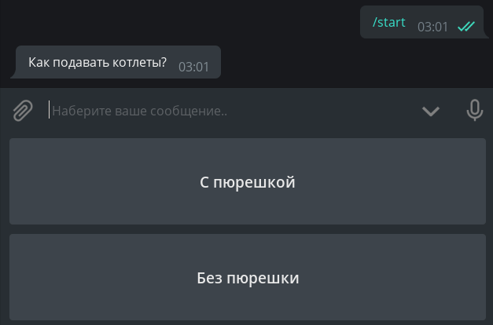

# Tugmalar

Ushbu bobda biz Telegram botlarining tugmalar kabi ajoyib xususiyati bilan tanishamiz. Avvalo, chalkashmaslik uchun ularga nom beraylik. Qurilmangiz ekranining pastki qismiga yopishib olganlarni **oddiy** tugmalar, to‘g‘ridan-to‘g‘ri xabarlarga yopishib olganlarni esa **inline** tugmalar deb nomlaymiz. Yana bir bor rasmga:  


## Oddiy tugmalar {: id="reply-buttons" }
### Shablon sifatidagi tugmalar {: id="reply-as-text" }

Ushbu turdagi tugma Bot APIga 2015 yilda paydo bo'lgan va oddiy matndan farqi yoq (bir nechta maxsus holatlar bundan mustasno, lekin ular haqida keyinroq). Принцип oddiy: tugmada yozilgan matn chatga yuboriladi va bot bosilgan tugmadagi matn bilan ishlovchi handlerga yuboradi. Foydalanuvchi tugma o'rniga tugmadagi matnni yozib yuborishi ham bosilganiga teng! Shuning uchun "matn shablonlari" deyishgan ya'ni pastdagi tugmalar aslida bular oddiy tayyor matnlar to'plami.

`/start` buyrug`i bosilganda ikkita tugma bilan xabar yuboradigan handler yozamiz:

```python
# from aiogram import types
@dp.message_handler(commands="start")
async def cmd_start(message: types.Message):
    keyboard = types.ReplyKeyboardMarkup()
    button_1 = types.KeyboardButton(text="С пюрешкой")
    keyboard.add(button_1)
    button_2 = "Без пюрешки"
    keyboard.add(button_2)
    await message.answer("Как подавать котлеты?", reply_markup=keyboard)
```

E'tibor bering, oddiy tugmalar matn shablonlari bo'lganligi sababli, ular nafaqat `KeyboardButton` obyektlari, balki oddiy stringlar sifatida ham yaratilishi mumkin.  

Keling, botni ishga tushiramiz va otni kallasidek keladigan tugmalardan hayratda qolamiz:



Qanaqadir juda xunuk. Birinchidan, men tugmalarni kichikroq qilishni, ikkinchidan, ularni gorizontal tartibga keltirishni xohlayman. Nima uchun ular juda katta? Gap shundaki, aslida "tugma" smartfon klaviaturasidagi oddiy alifbo kabi ko'proq joy egallashi kerak. Tugmalarni kichraytirish uchun siz `ReplyKeyboardMarkup` obyektiga qo'shimcha parametr `resize_keyboard=True` belgilashingiz kerak.  
Ammo vertikal tugmalarni gorizontallar bilan qanday almashtirish mumkin? Bot API nuqtai nazaridan keyboard bu tugmalardan iborat [massivlar massivi](https://core.telegram.org/bots/api#replykeyboardmarkup) yoki oddiyroq aytganda, qatorlar massividir. `add()` metodini har safar chaqirganda yangi qator hosil qiladi. Keling, chiroyli ko'rinishi uchun kodimizni qayta yozamiz:

```python
@dp.message_handler(commands="start")
async def cmd_start(message: types.Message):
    keyboard = types.ReplyKeyboardMarkup(resize_keyboard=True)
    buttons = ["С пюрешкой", "Без пюрешки"]
    keyboard.add(*buttons)
    await message.answer("Как подавать котлеты?", reply_markup=keyboard)
```

!!! info ""
    `*buttons` konstruktsiyasiga e'tibor bering. Bu C++ emas bu yulduzchadan _ro'yxatni ochish_ uchun ishlatilinadi.  
    `*` va `**` operatorlari haqida ko'proq ma`lumotni [bu yerda](https://tproger.ru/translations/asterisks-in-python-what-they-are-and-how-to-use-them/) o'qishingiz mumkin.

Ko'ring - bu haqiqatan ham chiroyli:


Botni bunday tugmalarni bosganda javob berishga o'rgatish qoldi. Yuqorida aytib o'tilganidek, matnning to'liq mos kelishini tekshirish kerak. Buni ikki usulda bajarishimiz mumkin: maxsus `Text` filtri yoki oddiy lambda orqali:

```python
# from aiogram.dispatcher.filters import Text
@dp.message_handler(Text(equals="С пюрешкой"))
async def with_puree(message: types.Message):
    await message.reply("Отличный выбор!")


@dp.message_handler(lambda message: message.text == "Без пюрешки")
async def without_puree(message: types.Message):
    await message.reply("Так невкусно!")
```


Matnli tugmalarni olib tashlash uchun siz `ReplyKeyboardRemove` maxsus "o'chirish" keyboardi bilan yangi xabar yuborishingiz kerak. Masalan:  
`await message.reply("Отличный выбор!", reply_markup=types.ReplyKeyboardRemove())`

!!! info ""
    [Oddiy keyboard obyekti (ReplyKeyboardMarkup)](https://core.telegram.org/bots/api#replykeyboardmarkup)da yana ikkita foydali parametr mavjud: tugmalarni bosgandan keyin yashirish uchun `one_time_keyboard` va `selective` keyboardni guruhdagi ayrim a'zolariga ko'rsatish uchun. Ulardan foydalanish mustaqil o'rganish uchun qoldiriladi, o'zing ko'rib chiq кароче.

    Yuqorida tavsiflangan standart parametrlarga qo'shimcha ravishda, aiogram `row_width` parametri bilan keyboardlarning funksionalligini biroz kengaytiradi. Undan foydalanilganda, aiogram avtomatik ravishda tugmalar massivini har biri N elementdan iborat qatorlarga ajratadi, bu erda N - `row_width` qiymati, masalan, `row_width=2`. Urunib ko'ring!

### Maxsus tugmalar {: id="reply-special" }
 
Telegramda oddiy tugmalarning uchta maxsus turi mavjud: biri manzilni yuborish, ikkinchisi telefon raqamini yuborish va oxirgisi so‘rov/viktorina yaratish uchun. Dastlabki ikkita tur uchun mantiqiy(bool) qiymatni ko'rsatish kifoya (True/False), so'rovlar va viktorinalar uchun esa maxsus turdagi `KeyboardButtonPollType`dan o'tishingiz va ixtiyoriy ravishda yaratiladigan obyekt(quiz/poll) turini belgilashingiz kerak.

Eng osoni, kodni bir marta ko'rish yaxshiroq:
```python
@dp.message_handler(commands="special_buttons")
async def cmd_special_buttons(message: types.Message):
    keyboard = types.ReplyKeyboardMarkup(resize_keyboard=True)

    keyboard.add(types.KeyboardButton(
        text="Joylashuvni so'rash", request_location=True
    ))
    keyboard.add(types.KeyboardButton(
        text="Kontaktni so'rash", request_contact=True
    ))
    keyboard.add(types.KeyboardButton(
        text="Viktorina yaratish",
        request_poll=types.KeyboardButtonPollType(type=types.PollType.QUIZ)
    ))

    await message.answer("Amalni tanlang:", reply_markup=keyboard)
```

## Inlayn tugmalar {: id="inline-buttons" }
### URL-tugmalar va callbacklar {: id="url-callback-buttons" }

Oddiy tugmalardan farqli o'laroq, inlayn tugmalar ekranning pastki qismiga emas, balki ular yuborilgan xabarga birikib keladi. Ushbu bobda biz bunday tugmalarning ikki turini ko'rib chiqamiz: URL va Callback. Yana biri - Switch - uni [inlayn rejim](inline_mode.md) haqidagi bobda muhokama qilamiz.

!!! info ""
    Kitobda "Login" va "Pay" tugmalari umuman ko'rib chiqilmaydi. Agar kimdir hech bo'lmaganda avtorizatsiya yoki to'lov uchun ishlab turgan kod bilan yordam berishni xohlasa, iltimos, [GitHub](https://github.com/MasterGroosha/aiogram-2-guide)da Pull Request yarating. Rahmat!

Eng oddiy inlayn tugmalar URL turiga mansubdir, ya'ni «havola». Va shuni unutmangki, faqat HTTP(S) va tg:// protokollari qo'llab-quvvatlanadi.

```python
@dp.message_handler(commands="inline_url")
async def cmd_inline_url(message: types.Message):
    buttons = [
        types.InlineKeyboardButton(text="GitHub", url="https://github.com"),
        types.InlineKeyboardButton("Telegram kanali", "tg://resolve?domain=telegram")
    ]
    keyboard = types.InlineKeyboardMarkup(row_width=1)
    keyboard.add(*buttons)

    await message.answer("Havolalar", reply_markup=keyboard)
```

Va agar siz ikkala tugmani ketma-ket joylashtirishni istasangiz, `row_width=1`ni olib tashlang (standart qiymat 3 ishlatilinadi).

URL tugmalari, aslida, muhokama qilish uchun boshqa hech narsa yo'q, shuning uchun bugungi dasturning diqqatga sazovor tomoniga o'tamiz - callback tugmalari. Bu juda kuchli narsa, uni deyarli hamma joyda ko'rishingiz mumkin. Xabarlar uchun reaksiya tugmalari (yoqtirishlar), @BotFather uchun menyular va boshqalar. Xulosa: callback tugmalari maxsus qiymatga (data) ega bo'lib, sizning ilovangiz nima bosilganligini va nima qilish kerakligini shundan bilib oladi.
Va to'g'ri datani tanlash **juda muhim**! Shuni ham ta'kidlash joizki, oddiy tugmalardan farqli o'laroq, callback tugmasini bosish sizga pitsa buyurtma qilishdan tortib, serverni qayta ishga tushirishgacha bo'lgan deyarli hamma narsani qilish imkonini beradi.

`/random` buyrug'i yordamida callback tugmasi bilan xabar yuboradigan handler yozamiz:
```python
@dp.message_handler(commands="random")
async def cmd_random(message: types.Message):
    keyboard = types.InlineKeyboardMarkup()
    keyboard.add(types.InlineKeyboardButton(
        text="Нажми меня", 
        callback_data="random_value"
    ))

    await message.answer(
        text="Нажмите на кнопку, чтобы бот отправил число от 1 до 10", 
        reply_markup=keyboard
    )
```

Lekin bosilgan tugmani qanday aniqlash kerak? Agar ilgari yuborilgan xabarlarni qayta ishlash uchun `message_handler`dan foydalangan bo‘lsak, endi callbacklarni qayta ishlash uchun `callback_query_handler`dan foydalanamiz. Biz tugmaning "qiymati"ga e'tibor qaratamiz, ya'ni. uning datasi:

```python
@dp.callback_query_handler(text="random_value")
async def send_random_value(call: types.CallbackQuery):
    await call.message.answer(str(randint(1, 10)))
```

!!! warning "Muhim"
    [CallbackQuery](https://core.telegram.org/bots/api#callbackquery) obyektidagi ma'lumot `data` deb nomlangan maydonda saqlanishi va u `data` deb nomlanishiga qaramay, aiogramda uni `text` filtri ostida nomlashgan. Yuqoridagi kodni filtriga e'tibor bering!
 


Bu soatcha nima? Ma’lum bo‘lishicha, Telegram serveri bizdan callbackni yetkazib berilganligini tasdiqlashimizni kutmoqda, aks holda u 30 soniya davomida aylanib turaveradi.  

Soatchani yashirish uchun siz callbackda `answer()` metodini ishlatishingiz kerak (ya'ni `answer_callback_query()`).  

Umuman olganda, siz `answer()` metodiga qo'shimcha hech narsa o'tkazishingiz shart emas, lekin siz maxsus oynachani chaqirishingiz mumkin.  

(ekranning tepasida yoki barcha oynalar ustidan alohida OK tugmasi mavjud oyna):

```python
@dp.callback_query_handler(text="random_value")
async def send_random_value(call: types.CallbackQuery):
    await call.message.answer(str(randint(1, 10)))
    await call.answer(text="Спасибо, что воспользовались ботом!", show_alert=True)
    # yoki shunchaki await call.answer()
```


!!! info "Eslatma"
    `send_random_value` funksiyasida biz `answer()` metodini `message`da emas, balki `call.message`da chaqirdik. Buning sababi, callback-handlerlari [Message](https://core.telegram.org/bots/api#message) bilan emas, balki boshqa maydon(field)larga ega bo'lgan [CallbackQuery](https://core.telegram.org/bots/api#callbackquery) bilan ishlaydi va `message` uning bir qism(field)i xolos.  
    Shuni ham yodda tutingki, `call.message` - tugma biriktirilgan xabardir (bu xabar egasi botning o'zi).

!!! question "Qachon `answer()`ni ishlatish kerak?"
    Umuman olganda, asosiysi Telegramga callbackni qabul qildik ma'nosida xabar berishni unutmaslik kerak, men `answer()`ni doim eng oxirida qo‘yishni tavsiya qilaman, buning sababi: agar callbackni handle qilish (qayta ishlash) jarayonida xatolik yuz bersa, va bot exceptionga tushib qolsa, foydalanuvchi yuqolmayotgan soatchani ko'radi va nimadir noto'g'ri ekanligini tushunadi. Darhol javob qaytarilsa, soatcha yuqoladi va foydalanuvchi uning so'rovi muvaffaqiyatli bo'ldimi yoki yo'qmi, qorong'ulikda qoladi.


Keling, qiyinroq misolga o'tamiz. Foydalanuvchiga 0 raqami bilan message yuborib, unga uchta inlayn tugma: "+1", "-1" va "Tasdiqlash" keyboard biriktiramiz. Birinchi ikkitasi bilan u raqam qiymatini mos ravishda +1 ga va -1 ga oshirib messageni edit(tahrir) qiladi, oxirgisi esa o'zgarishlarni tasdiqlab, inlayn keyboardni o'chiradi.

```python
# Bu yerda foydalanuvchi ma'lumotlari saqlanadi.
# Qiymatni lug'at(dict) xotirasida saqlaymiz,
# u qayta ishga tushirilganda tozalanadi
user_data = {}

def get_keyboard():
    # Keyboard yaratish.
    buttons = [
        types.InlineKeyboardButton(text="-1", callback_data="num_decr"),
        types.InlineKeyboardButton(text="+1", callback_data="num_incr"),
        types.InlineKeyboardButton("Подтвердить", callback_data="num_finish")
    ]

    keyboard = types.InlineKeyboardMarkup(row_width=2)
    keyboard.add(*buttons)

    return keyboard


async def update_num_text(message: types.Message, new_value: int):
    # Xabarni yangi qiymat bilan o'zgartiramiz
    await message.edit_text(
        text=f"Укажите число: {new_value}", 
        reply_markup=get_keyboard()
    )

# /numbers buyrug'i uchun handler
@dp.message_handler(commands="numbers")
async def cmd_numbers(message: types.Message):
    user_data[message.from_user.id] = 0
    await message.answer("Укажите число: 0", reply_markup=get_keyboard())


@dp.callback_query_handler(Text(startswith="num_"))
async def callbacks_num(call: types.CallbackQuery):
    # Foydalanuvchining joriy qiymatni olamiz
    user_value = user_data.get(call.from_user.id, 0)

    # stringni bo'laklab qaysi amal bajarish kerakligini ko'satamiz,
    # ya'ni, `num_incr` -> `['num', 'incr']` -> `incr`
    action = call.data.split("_")[1]

    if action == "incr":
        user_data[call.from_user.id] = user_value + 1
        await update_num_text(call.message, user_value + 1)

    elif action == "decr":
        user_data[call.from_user.id] = user_value - 1
        await update_num_text(call.message, user_value - 1)

    elif action == "finish":
        # Biz xabarni o'zgartirmasdan, 
        # await call.message.delete_reply_markup()
        # chaqirib keyboardni o'chirib tashlashimiz mumkin edi. 
        # Ammo xabarni edit qilib va yangi keyboard yubormasak ham, 
        # default `reply_markup=None` bo'lganligi uchun keyboard o'chiriladi.
        await call.message.edit_text(f"Итого: {user_value}")

    # Callbackni qabul qildik u bilan ishladik, tg xavotirlanma.
    await call.answer()
```

Va hammasi ishlayotganga o'xshaydi: 


Ammo keling qaysidir aqlli foydalanuvchi `/numbers` buyrug'ini chaqirdi (qiymat 0 ga teng) va qiymatni "+1" ga oshirdi (qiymat 1), va yana bir marta `/numbers`ni chaqirdi (endi qiymat yana 0 ga tenglandi). Endi bu "полуфабрикат" birinchi yuborgan buyrug'iga kelgan xabardagi "+1" tugmasiga yana bosdi deb tasavvur qilaylik.

Xo'sh nima bo'ladi? Bot halollik bilan matndagi qiymatni "1"ga edit qilishga harakat qiladi, lekin bu matn allaqachon 1 qiymatiga ega, Bot API eski matn, yangi matn bilan bir xil ekanligi to'g'risidagi xatoni qaytaradi va bot exceptionga uchraydi:  

`aiogram.utils.exceptions.MessageNotModified: Message is not modified: specified new message content and reply markup are exactly the same as a current content and reply markup of the message`


Avvaliga xabarlarni edit qilishga urinayotganda, bu xatoga tez-tez duch kelishingiz mumkin. Ammo, aslida, muammo juda oddiy hal qilinadi: biz shunchaki `MessageNotModified` exceptionini e'tiborsiz qoldirishimiz kerak. [Birinchi bobdan](quickstart.md#_3) siz `errors_handler` kabi ajoyib narsa haqida allaqachon bilasiz, lekin bu safar biz bunga biroz boshqacha yondashamiz va `update_num_text()` funksiyasini quyidagicha qayta yozamiz:

```python
# from aiogram.utils.exceptions import MessageNotModified
# from contextlib import suppress

async def update_num_text(message: types.Message, new_value: int):
    with suppress(MessageNotModified):
        await message.edit_text(
            text=f"Укажите число: {new_value}",
            reply_markup=get_keyboard()
        )
```

Agar siz hozir yuqoridagi misoldagi aqlli foydalanuvchini harakatlarini takrorlashga harakat qilsangiz, bot ushbu kod blokdagi ko'rsatilgan Excepionni ignore qiladi (e'tiborsiz qoldiradi).

### Callbacklar fabrikasi {: id="callback-factory" }

Aiogramda callback-factory deb ataladigan shunday narsa bor. Siz `CallbackData` obyektini yaratasiz, unga [prefiks](https://qomus.info/encyclopedia/cat-p/prefiks-uz/) va ixtiyoriy miqdordagi argumentlarni kiritasiz, keyinchalik ularda ma'lumotlar saqlash uchun.

Masalan, quyidagi obyektni ko'rib chiqing:
```python
# from aiogram.utils.callback_data import CallbackData

cb = CallbackData("post", "id", "action")

# post - bu prefiks filter ajratib olishi uchun (unikallashirish uchun)
# id - bu o'zimiz yozgan yangi argument bu yerda biz idlarni kiritishimiz mumkin
# action - ham argument bu yerda qanaqadir harakat nomini kiritamiz
```
Tugma yaratishda siz uning parametrlarini quyidagicha belgilashingiz kerak:
```python
button =  types.InlineKeyboardButton(
    text="Layk bosish", 
    callback_data=cb.new(id=5, action="like")
)

# bu yerda callback_data = 'post:5:like'
```

Endi `post` prefiksi uchun handler quyidagicha bo'ladi:
```python
@dp.callback_query_handler(cb.filter())
async def callbacks(call: types.CallbackQuery, callback_data: dict):
    post_id = callback_data["id"]
    action = callback_data["action"]
    print(post_id, action) # 5 like
```

Raqamlar bilan oldingi misolda biz `callback_data`ni qiymatini ajratib olish oson qilib tanlagan edik, hamda vazifamiz bor-yog'i 3ta ishdan iborat ekanligini inobatga olib `callback_query_handler`ni bitta funksiya ichida "реализовать" qildik. Ammo biz vazifani "+1" va "-1" bosilganda alohida handler yoki bo'lmasam "Tasdiqlash" tugmasini bosilganda alohida handlerga mantiqiy bo'lib berishimiz mumkin.

Buning uchun siz fabrika filtrida yasagan obyektingiz argumentlarining biriga tugmaga berilgan qiymatlarni mos ravishda ko'rsatishingiz kerak.  

Keling, misolimizni qayta yozamiz:

```python
# fabnum - prefiks, action - biz qiymat kiritadigan argument nomi
callback_numbers = CallbackData("fabnum", "action")


def get_keyboard_fab():
    buttons = [
        types.InlineKeyboardButton(
            text="-1", 
            callback_data=callback_numbers.new(action="decr")
        ),
        types.InlineKeyboardButton(
            text="+1", 
            callback_data=callback_numbers.new(action="incr")
        ),
        types.InlineKeyboardButton(
            text="Подтвердить", 
            callback_data=callback_numbers.new(action="finish")
        )
    ]

    keyboard = types.InlineKeyboardMarkup(row_width=2)
    keyboard.add(*buttons)

    return keyboard


async def update_num_text_fab(message: types.Message, new_value: int):
    with suppress(MessageNotModified):
        await message.edit_text(
            text=f"Укажите число: {new_value}", 
            reply_markup=get_keyboard_fab()
        )


@dp.message_handler(commands="numbers_fab")
async def cmd_numbers(message: types.Message):
    user_data[message.from_user.id] = 0
    await message.answer("Укажите число: 0", reply_markup=get_keyboard_fab())


@dp.callback_query_handler(callback_numbers.filter(action=["incr", "decr"]))
async def callbacks_num_change_fab(call: types.CallbackQuery, callback_data: dict):
    user_value = user_data.get(call.from_user.id, 0)
    action = callback_data["action"]

    if action == "incr":
        user_data[call.from_user.id] = user_value + 1
        await update_num_text_fab(call.message, user_value + 1)

    elif action == "decr":
        user_data[call.from_user.id] = user_value - 1
        await update_num_text_fab(call.message, user_value - 1)

    await call.answer()


@dp.callback_query_handler(callback_numbers.filter(action=["finish"]))
async def callbacks_num_finish_fab(call: types.CallbackQuery):
    user_value = user_data.get(call.from_user.id, 0)
    await call.message.edit_text(f"Итого: {user_value}")
    await call.answer()
```

Shunday qilib tugmalar haqidagi bob tugadi, keyingi boblarda ularning boshqa turlari haqida gaplashamiz.