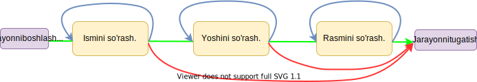

# FSM (Steytlar) {: id="fsm-start" }

!!! tip "Aiogramning eski versiyasi"
    Aiogram 3.x uchun ushbu bob [bu yerda](https://mastergroosha.github.io/aiogram-3-guide/fsm/). (rus tilida!)

??? warning "Bob yangilanishi (ko‘rsatish uchun bosing)" 
    Bu bob 2022-yil sentabrida yangilandi, chunki steytlar aro biridan ikkinchisiga o'tish/qaytish usullari uchun xato maslahat/tushuncha berilgan. Xususan: steytning o'zida `.set()` usulini chaqirish tavsiya etilmaydi; Buning o'rniga FSMContext obyektida `set_state()` metodidan foydalanish yaxshiroq. Bundan tashqari, agar sizda ketma-ket aniq bo'lmagan xatti-harakatlar mavjud bo'lsa `.next()` metodidan foydalanmang.

## Teoriya {: id="theory" }

Ushbu bobda biz botlarning, eng muhim xususiyati **dialog tizimi** haqida gaplashamiz. Afsuski, botdagi barcha amallarni bitta xabar yoki buyruqda bajarish mumkin emas. Aytaylik, tanishuv boti bor, u yerda ro'yxatdan o'tayotganda ismingizni, yoshingizni ko'rsatishingiz va rasmingizni yuborishingiz kerak. Siz, albatta, foydalanuvchidan rasm captionida hamma ma'lumotlarni yozib yuborishini so'rashingiz mumkin, ammo bu foydalanuvchi uchun ham sizning handleringiz uchun ham noqulay. Endi ma'lumotlarni bosqichma-bosqich kiritishni tasavvur qiling, bunda boshida bot ma'lum bir foydalanuvchidan ma'lum ma'lumotni kutish rejimini «yoqadi», so'ngra har bir bosqichda kiritilgan ma'lumotlarni tekshiradi va `/cancel` buyrug'i berilsa u keyingi qadamni kutishni to'xtatadi va asosiy rejimga qaytadi. Quyidagi sxemani ko'rib chiqing:



**Yashil** rang qadamlarni xatosiz o'tish jarayonini ko'rsatadi, **ko'k** joriy holatni saqlash va qayta kiritishni kutishni anglatadi (masalan, agar foydalanuvchi 250 yoshda ekanligini ko'rsatgan bo'lsa, siz yana yoshni so'rashingiz kerak), va **qizil** butun jarayondan chiqishni ko'rsatadi (masalan, `/cancel` buyrug'i dialogni to'xtatishi).

Yuqoridagi diagrammadagi jarayon FSM — Finite State Machine deb ataladi. Bu haqda ko'proq ma'lumotni [bu yerda](https://tproger.ru/translations/finite-state-machines-theory-and-implementation/) o'qishingiz mumkin.

## Amaliyot {: id="practice" }

Aiogramda FSM mexanizmi [pyTelegramBotAPI](https://mastergroosha.github.io/telegram-tutorial/docs/lesson_11/)ga qaraganda ancha yaxshi ishlab chiqilgan. Freymvork ma'lum bir steytlar orasida olingan ma'lumotlarni saqlash uchun turli xil backendlarga ega va steytlarga qo'shimcha ravishda siz o'zingizni ma'lumotlaringizni keyinchalik biror joyda foydalanish uchun saqlashingiz mumkin. Mavjud FSM xotira(storage)lar ro'yxatini [aiogram repo](https://github.com/aiogram/aiogram/tree/dev-2.x/aiogram/contrib/fsm_storage)sida topish mumkin va bu bobda biz barcha ma'lumotlarni RAMda saqlaydigan eng oddiy [MemoryStorage](https://github.com/aiogram/aiogram/blob/dev-2.x/aiogram/contrib/fsm_storage/memory.py) backendidan foydalanamiz. Bu bizning ko'rsatadigan misollarimiz uchun mos, lekin uni real loyihalarda ishlatish **tavsiya etilmaydi**, chunki MemoryStorage barcha ma'lumotlarni diskka o'tkazmasdan operativ xotirada saqlaydi. Shuni ham ta'kidlash joizki, FSM nafaqat xabarlar bilan ishlovchilar (`message_handler`, `edited_message_handler`), balki callbacklar va inline rejimi bilan ham qo'llanilishi mumkin.

Misol tariqasida biz kafeda oziq-ovqat va ichimliklar buyurtma qilish uchun steytlar yozamiz va shu bilan birga turli xil handlerlarni alohida fayllarda saqlashni o'rganamiz (Templating).

!!! warning "Muhim"
    Sahifada hamma bot kodlari ham ko'rib chiqilmaydi, o'qish oson bo'lishi uchun ba'zi importlar va handlerlar o'tkazib yuborilgan. Kodlarni [GitHub](https://github.com/metabrozzpy/aiogram-2-guide-uz)da topish mumkin.

!!! info "Minnatdorchilik"
    **Tishka17**ning [tgbot_template](https://github.com/Tishka17/tgbot_template)dan fayllar va kataloglar tuzilishi template(shablon) sifatida olindi. Ushbu bobda uning soddalashtirilgan versiyasi ko'rib chiqiladi, so'ngra bot murakkablashgani sayin fayl strukturasi kengayadi.  
    Umuman olganda, Rahmat!

### Fayl va katalog tuzilishi {: id="structure" }

Botimizni ishga tushuruvchi fayl `bot.py` fayli bo'ladi, uning yonida `bot.ini` konfiguratsiya(sozlama)lar fayli bilan «config» papkasi joylashgan. Oldingi boblarda faqat bitta o'zgaruvchi environment variables orqali kiritilgan edi, lekin juda ko'p sozlamalar mavjud bo'lganida, alohida sozlamar faylidan foydalanish va uni standart Python [Configparser](https://docs.python.org/3/library/configparser.html) bilan o'qish yaxshi. `app` papkasi ichida sozlamalar faylini o'qish uchun mas'ul bo'lgan `config.py` fayli, shuningdek, mantiqiy ravishda steytlarimizning turli qadamlari uchun handlerlar bilan `handlers` papkasi ham joylashgan.

Sxematik ravishda, yuqorida aytilganlarning barchasi quyidagicha ko'rinadi:

```
├── app/
│ ├── config.py
│ ├── handlers/
│ │ ├── common.py
│ │ ├── drinks.py
│ │ ├── food.py
│ │ └── __init__.py
│ └── __init__.py
├── config/
│ └── bot.ini
├── bot.py
└── requirements.txt
```

!!! info "Modullar, fayllar va papkalar haqida"
    Pythondagi modullar `*.py` fayllarini boshqa papkalarda chaqirish o'zaro konflikt keltirmasdan import qilish, papkalardagi `__init__.py` fayllari haqida bilsangiz kerak endi. Batafsil ushbu [devpractice.ru](https://devpractice.ru/python-lesson-13-modules-and-packages/) saytdan o'qib, o'rganishingiz mumkin.

### Qadamlarni yaratish {: id="define-states" }

Keling oziq-ovqatlar «buyurtma berish» bosqichini ko'rib chiqamiz. Boshlanishiga, `app/handlers/food.py` faylida biz kerakli obyektlarni import qilamiz va taomlar hamda ularning portsiya hajmlarini alohida listlarga yozib chiqamiz (realda bu ma'lumotlarni har qanday DBdan dinamik ravishda yuklashingiz mumkin):

```python
from aiogram import Dispatcher, types
from aiogram.dispatcher import FSMContext
from aiogram.dispatcher.filters.state import State, StatesGroup

available_food_names = ["sushi", "spagetti", "xachapuri"]
available_food_sizes = ["kichik", "o'rtacha", "katta"]
```

Keling, ma'lum bir jarayonning barcha mumkin bo'lgan «holatlarini» yozib chiqaylik (oziq-ovqat tanlash): foydalanuvchi `/food` buyrug'ini chaqiradi, bot sizdan taom tanlashni so'ragan xabar bilan javob beradi va foydalanuvchidan \*taom tanlanishini kutish\* steytiga tushadi. Foydalanuvchi tanlovni amalga oshirishi bilanoq, bot kiritilgan ma'lumotlarning to'g'riligini tekshiradi va keyingi steytda \*portsiya hajmi\*ni tanlashini kutib turadi. Foydalanuvchi bu yerda ham to'g'ri ma'lumotlarni kiritganida, bot yakuniy natijani (buyurtmani) ko'rsatadi va jarayon yakunlanadi (finish). Keyinroq, `/cancel` buyrug'i bilan istalgan bosqichda steytdan chiqish (jarayonni bekor qilish)ni o'rganamiz.

Endi, steytlarimizni yozamiz. Ularni foydalanuvchi borishi kerak bo'lgan tartibda aniq yozish tavsiya etiladi (ya'ni birinchi taom tanlash, so'ngra portsiyani tanlash), bu kodni tushunarliroq qiladi. Steytarni saqlash uchun siz `StatesGroup` classidan meros class(steyt guruhi) yaratib, uning ichida `State` klassi ekzemplyariga teng o'zgaruvchilar yaratishimiz kerak:

```python
class OrderFood(StatesGroup):
    waiting_for_food_name = State()
    waiting_for_food_size = State()
```

`/food` buyrug'iga javob beradigan birinchi qadam(steyt) uchun handlerini yozamiz (uni keyinroq ro'yxatdan o'tkazamiz):

```python
# E'tibor bering: ikkinchi argument mavjud
async def food_start(message: types.Message, state: FSMContext):
    keyboard = types.ReplyKeyboardMarkup(resize_keyboard=True)
    for name in available_food_names:
        keyboard.add(name)

    await message.answer("Taom tanlang:", reply_markup=keyboard)
    await state.set_state(OrderFood.waiting_for_food_name.state)
```

Oxirgi qatorda biz botga `OrderFood` guruhidan `waiting_for_food_name` steytini o'rnatishini aytdik. Endi u `/food` buyru'gidan keyin taomlarimiz menyusi bilan foydalanuvchidan ma'lumot kutib turadi. 

Quyidagi funksiya esa foydalanuvchidan olingan matnni saqlab (agar u to'g'ri bo'lsa) keyingi bosqichga o'tkazadi:

```python linenums="1"
async def food_chosen(message: types.Message, state: FSMContext):
    if message.text.lower() not in available_food_names:
        await message.answer("Iltimos, menyudan foydalaning.")
        return

    await state.update_data(chosen_food=message.text.lower())

    keyboard = types.ReplyKeyboardMarkup(resize_keyboard=True)
    for size in available_food_sizes:
        keyboard.add(size)

    await state.set_state(OrderFood.waiting_for_food_size.state)
    await message.answer("Endi portsiyani tanlang:", reply_markup=keyboard)
```

Keling, yuqoridagi kodning ba'zi qatorlarni alohida tahlil qilaylik. `food_chosen` funksiya (1-qator) `FSMContext` turidagi ikkinchi `state` argumentga ega. U orqali siz FSM-backendidan ma'lumotlarni olishingiz mumkin. 2-qator foydalanuvchidan kelgan matnni tekshiradi. Agar u o'zboshimchalik bilan matn kiritgan bo'lsa va tugmalardan foydalanmasa, xato haqida xabar berishimiz va funksiyani muddatidan oldin tugatishimiz kerak. Bunday holda, foydalanuvchining qadami o'zgarmay qoladi va bot yana taom tanlanishini kutadi. Biz 5-qatorda, foydalanuvchi taomni to'g'ri kiritganiga уже aminmiz, shuning uchun biz qabul qilingan matnni FSM bazasiga xavfsiz saqlashimiz mumkin. `update_data()` funksiyasidan foydalanamiz va xabar matnini `chosen_food` kaliti ostida `message.text.lower()` qiymati bilan saqlaymiz. 11-qatorda biz foydalanuvchini keyingi bosqichga o'tkazishga tayyormiz va ichida kerakli steyt bilan `set_state(...)` metodini chaqiramiz.

Porstiya hajmini olish (shunga o'xshash matn tekshiruvi bilan) va natijalarni foydalanuvchiga ko'rsatish uchun javobgar oxirgi funksiyani yozish qoldi:

```python
async def food_size_chosen(message: types.Message, state: FSMContext):
    if message.text.lower() not in available_food_sizes:
        await message.answer("Iltimos, menyudan foydalaning.")
        return
    user_data = await state.get_data()
    await message.answer(
        f"Buyurtma: {user_data['chosen_food']} taomidan {message.text.lower()} ports.\n"
        f"Ichimlik buyurtma berish uchun: /drinks", 
        reply_markup=types.ReplyKeyboardRemove()
    )
    await state.finish()
```

E'tiboringizni qarating: Birinchidan, biz FSMdan saqlangan ma'lumotlarni `state`ning `get_data()` metodi yordamida olishimiz mumkin. Ikkinchidan, bu ma'lumotlar `dict` ko'rinishida saqlangani uchun, olishda `user_data['chosen_food']`dan foydalanishimiz mumkin (`dict`da qaysidir kalit bo'lmasligi mumkinligini unutmang, bu `KeyError`ga olib keladi, yaxshisi `.get('chosen_food')` metodidan foydalaning). Uchinchidan, `finish()` metodini chaqirish nafaqat steytni to'xtatadi, balki saqlangan ma'lumotlarni ham o'chiradi. Agar siz faqat steytni to'xtatishingiz kerak bo'lsa, `await state.reset_state(with_data=False)`dan foydalaning.

Va nihoyat, yuqoridagi funksiylarning handlerlarini ro'yxatdan o'tkazish uchun alohida bitta funksiya yozamiz, u argumentida dispetcherni qabul qiladi. `food_start()`ni ro'yxatdan o'tkazishda steyt parametriga "\*" qiymatini qo'yganimiz istalgan qadam(steyt)dan chiqib ishlashini bildiradi. Qo'pol qilib aytganda, agar foydalanuvchi \*portsiya hajmini tanlash\* steytida bo'lsa-yu, lekin qaytadan boshlashga qaror qilsa va `/food`ga buyruq bersa, bot `food_start()`ni chaqiradi va butun jarayonni qaytadan boshlaydi.

```python
def register_handlers_food(dp: Dispatcher):
    dp.register_message_handler(food_start, commands="food", state="*")
    dp.register_message_handler(food_chosen, state=OrderFood.waiting_for_food_name)
    dp.register_message_handler(food_size_chosen, state=OrderFood.waiting_for_food_size)
```

Ichimlik tanlash bosqichlari ham xuddi shu tarzda amalga oshiriladi. Buni o'zingiz sinab ko'ring yoki ushbu bobning githubda manbalariga qarang.

### Umumiy buyruqlar {: id="common-commands" }

Biz steytlarni qayta boshlash yoki to'xtatish haqida gapirayotgan ekanmiz, keling, `app/handlers/common.py` faylida `/start` buyrug'i va «bekor qilish» amaliga javob beruvchi handlerlarni yozamiz. Birinchisi xush kelibsiz/qo'llanma matnini ko'rsatadi, ikkinchisi esa "Harakat bekor qilindi" deb yozadi. Ikkala funksiya ham steyt va ma'lumotlarni o'chirib yuboradi va agar mavjud bo'lsa, replykeyboardni olib tashlaydi:

```python
async def cmd_start(message: types.Message, state: FSMContext):
    await state.finish()
    await message.answer(
        "Buyurtma qilmoqchi bo'lgan narsani tanlang:\n"
        "ichimliklar (/drinks) yoki taom (/food).",
        reply_markup=types.ReplyKeyboardRemove()
    )

async def cmd_cancel(message: types.Message, state: FSMContext):
    await state.finish()
    await message.answer(
        text="Harakat bekor qilindi", 
        reply_markup=types.ReplyKeyboardRemove()
    )
```

Ikkila handlerni ro'yxatdan o'tkazamiz:

```python
def register_handlers_common(dp: Dispatcher):
    dp.register_message_handler(cmd_start, commands="start", state="*")
    dp.register_message_handler(cmd_cancel, commands="cancel", state="*")
    dp.register_message_handler(cmd_cancel, Text(equals="bekor qilish", ignore_case=True), state="*")
```

Nega ikkita emas, uchta qator? Gap shundaki, bitta handlerni turli xil hodisalarda chaqirish mumkin. Bu yerda biz `/cancel` buyrug'ida ham, "Bekor qilish" xabarini (katta-kichik harflarda) yuborishda ham chaqiriladigan `cmd_cancel()` funksiyasini ro'yxatdan o'tkazdik. Aytgancha, agar siz dekoratorlardan foydalanmoqchi bo'lsangiz, u quyidagicha ko'rinadi:

```python
@dp.message_handler(commands="cancel", state="*")
@dp.message_handler(Text(equals="bekor qilish", ignore_case=True), state="*")
async def cmd_cancel(message: types.Message, state: FSMContext):
    ...
```

### Kirish nuqtasi {: id="entrypoint" }

Keling, `bot.py` fayliga qaytaylik va ikkita funksiya yozaylik: `set_commands()` va `main()`. Birinchisida biz Telegramda `Menyu` yoki `[ / ]` tugmasini bosishda chiqadigan, buyruqlar ro'yxatini kiritamiz, ikkinchisida esa botni ishga tushirish uchun kerakli amallarni bajaramiz: handlerlarni ro'yxatga olish, konfiguratsiya faylini o'qish, `Bot` va `Dispetcher`ni yaratish, va nihoyat botni polling rejimida ishga tushirish:

```python
# Importlarni unutmang

logger = logging.getLogger(__name__)

# Telegramda ko'rsatiladigan 
# buyruqlarni ro'yxatdan o'tkazish
async def set_commands(bot: Bot):
    commands = [
        BotCommand(command="/drinks", description="Ichimlik buyurtma berish"),
        BotCommand(command="/food", description="Taom buyurtma berish"),
        BotCommand(command="/cancel", description="Joriy harakatni bekor qilish")
    ]
    await bot.set_my_commands(commands)


async def main():
    logging.basicConfig(
        level=logging.INFO,
        format="%(asctime)s - %(levelname)s - %(name)s - %(message)s",
    )
    logger.error("Starting bot")

    # bot.ini faylini o'qish
    config = load_config("config/bot.ini")

    # Bot va dispetcher obyektlari
    bot = Bot(token=config.tg_bot.token)
    dp = Dispatcher(bot, storage=MemoryStorage())

    # Handlerlarni ro'yxatdan o'tkazish
    register_handlers_common(dp)
    register_handlers_drinks(dp)
    register_handlers_food(dp)

    # Bot buyruqlarini sozlash
    await set_commands(bot)

    # Botni pollingda ishga tushurish
    # await dp.skip_updates()  # eski updatelarni o'tkazib yuborish (ixtiyoriy)
    await dp.start_polling()


if __name__ == '__main__':
    asyncio.run(main())
```

Endi, FSM bilan qurollangan holda, siz qo'rqmasdan dialog tizimli botlarni yozishingiz mumkin.
