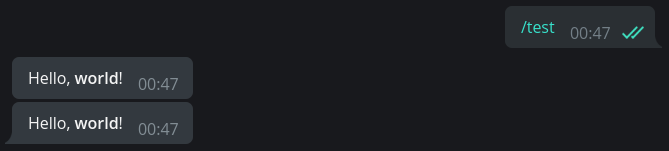
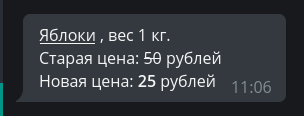
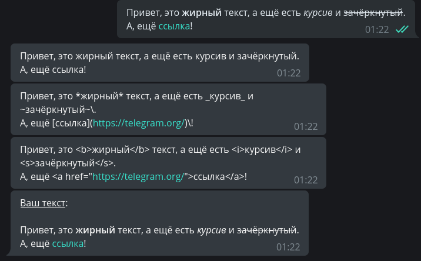
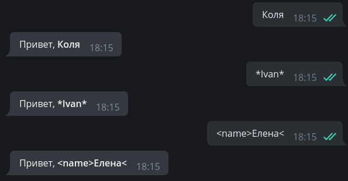
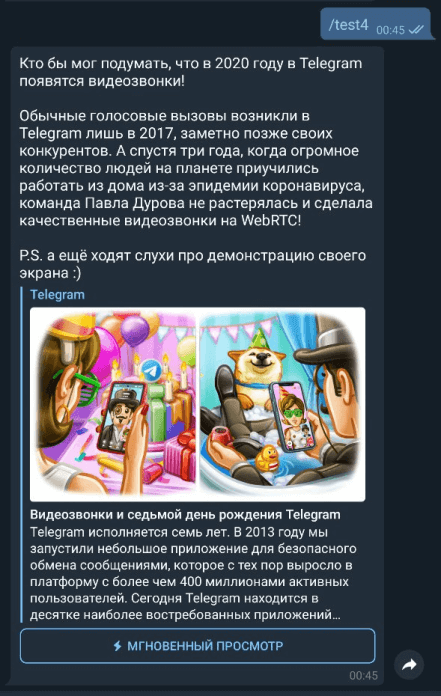

# Xabarlar bilan ishlash

Ushbu bobda biz xabarlarga har xil formatlash turlarini qo'llash va media fayllar bilan ishlashni o'rganamiz.

## Matn {: id="text" }

Xabarlarda matnlar bilan ishlash, bu, deyarli barcha botlar uchun eng muhimlaridan biridir. Matn deyarli hamma narsani ifodalashi mumkin va shu bilan birga ma'lumotni _chiroyli_ ko'rinishi foydalanuvchida ham o'zgacha taasurot qoldiradi. Dasturchi matnni formatlashning uchta usuliga ega: **HTML**, **Markdown** va **MarkdownV2**. HTML va MarkdownV2 ularning eng ilg'orlari hisoblanadi, "klassik" Markdown eski va kamroq funksiyalari bo'lgani uchun kamroq foydalanamiz.

`parse_mode` argumenti xabarlarni yuborishda formatlashni tanlash uchun javobgar parametr, masalan:

```python
from aiogram import types

# funksiyaning biron bir joyida...
await message.answer("Hello, <b>world</b>!", parse_mode=types.ParseMode.HTML)
# Enum* o'rniga parse_mode'ga oddiy satr(string) sifatida kiritish ham mumkin:
await message.answer("Hello, *world*\!", parse_mode="MarkdownV2")
```

!!! question "\*Enum nima?"
    [Enum[erations]](https://docs.python.org/3/howto/enum.html) - bu unikal qiymatlarga ega konstanta(o'zgarmas)lar to'plami deyish mumkin. Ular global o'zgaruvchilarga o'xshaydi, lekin ular yanada foydali: [repr()](https://docs.python.org/3/library/functions.html#repr), guruhlash, turlardagi xavfsizlik va boshqa bir qancha xususiyatlarga ega.



Agar ma'lum bir formatlash usuli botning hamma joyida ishlatilsa, har safar `parse_mode` argumentini metodlarda belgilash ancha qimmatga tushadi. Yaxshiyamki, aiogramda siz kerakli formatlashni to'g'ridan-to'g'ri **Bot** obyektiga o'tkazishingiz mumkin va agar biron bir holatda siz ushbu formatlashni bekor qilishingiz kerak bo'lsa, shunchaki `parse_mode=""` (bo'sh qator) qoldirasiz:

```python
# endi hamma matn bilan ishlovchi metodlarda HTML qo'llaniladi
bot = Bot(token="123:abcxyz", parse_mode=types.ParseMode.HTML)

# funksiyaning biron bir joyida...
await message.answer("Сообщение с <u>HTML-разметкой</u>")
await message.answer("Сообщение без <s>какой-либо разметки</s>", parse_mode="")
```


Xabarni formatlashning nafaqat tepada ko'rgan "dasturiy" usuli ya'ni html, markdown bilan qo'lda taglarni ochib-yopish, balki "dinamik" usuli ham mavjud. Buning uchun `aiogram.utils`dan `markdown` modulini import qilishingiz kerak, bu modul nomiga qaramay, HTMLni ham qo'llab-quvvatlaydi.  

Qisqasi "dinamik" usul ham syurpriz emas, import qilingan `markdown`dan `text()` funksiyasini chaqirib, uni ichiga formatlanadigan matnimizni ham alohida mos ravishda funksiyalarni chaqirgan holda `text()` funksiyasini ichida ishlatishimizga to'g'ri keladi, hammasi matnga bog'liq ammo siz taglardan qo'rqsangiz, ochib qaytib yopish esdan chiqsa sizga ancha qo'l kelishi mumkin.  

Formatlash ham funksiyalar bilan belgilanadi deganimiz ya'ni `hbold()` funksiya ichiga matningizni qo'yib chaqirasz, funksiya boshidagi "h" esa HTML degan ma'noni anglatadi, va ushbu funksiya unga berilgan matnni HTMLda qalin (`<b>matn</b>`) qilishi kerakligini bildiradi.

Bilaman hech narsaga tushunmadingiz, umuman olganda, quyidagi kod va skrinshotga qarang. Matn formatlashning ushbu usuli foydalanishga arziydimi-yoqmi sizga bog'liq:

```python
import aiogram.utils.markdown as fmt

# funksiyaning biron bir joyida...
await message.answer(
        fmt.text(
            fmt.text(fmt.hunderline("Яблоки"), ", вес 1 кг."),
            fmt.text("Старая цена:", fmt.hstrikethrough(50), "рублей"),
            fmt.text("Новая цена:", fmt.hbold(25), "рублей"),
            sep="\n"
        ), parse_mode="HTML"
    )
```

Oxiridagi `sep` argumenti matn qismlari orasidagi ajratuvchini belgilaydi.



Formatlab yuborishdan tashqari, Aiogram sizga foydalanuvchi yuborgan (umuman olganda kiruvchi) matnni oddiy matn (plain text), HTML va Markdown sifatida olish imkonini beradi. Quyidagi skrinshotda ko'rishingiz mumkin. Bu yuboruvchiga uning xabarini kichik o'zgarishlar bilan qaytarishni istasangiz, foydalanish uchun qulaydir:

```python
@dp.message_handler()
async def any_text_message(message: types.Message):
    await message.answer(message.text)
    await message.answer(message.md_text)
    await message.answer(message.html_text)
    # Asl matnni to'ldiramiz:
    await message.answer(
        f"<u>Ваш текст</u>:\n\n{message.html_text}", parse_mode="HTML"
    )
```



Hammasi yaxshi, lekin formatlashdan foydalanishda muammo bor: ayyor foydalanuvchilar (hakrlar) ismlarida yoki xabarlarida maxsus tag va belgilarni foydalanishi mumkin va bu botni xato ishlashiga yoki buzishiga olib keladi. Biroq, aiogramda bunday holatlardan `escape_md()` и `quote_html()` yordamchi funksiyalar bilan qochish mumkin (umuman olganda qochilmaydi, matn tozalanadi).   
Yoki yuqorida ko'rsatilgan usuldan foydalanishingiz mumkin (h)bold, (h)italic va boshqalar:

```python
@dp.message_handler()
async def any_text_message2(message: types.Message):
    await message.answer(
        text=f"Привет, <b>{fmt.quote_html(message.text)}</b>", 
        parse_mode=types.ParseMode.HTML
    )
    # Va bunday ham bo'lishi mumkin:
    await message.answer(
        text=fmt.text("Привет,", fmt.hbold(message.text)), 
        parse_mode=types.ParseMode.HTML
    )
```



!!! info ""
    Turli formatlash usullari va qo'llab-quvvatlanadigan teglar haqida batafsil ma'lumotni [Bot API "документация"](https://core.telegram.org/bots/api#formatting-options)larida olishingiz mumkin.

## Mediafayllar {: id="media" }

Oddiy matnli xabarlardan tashqari Telegram sizga turli xil turdagi media fayllarni: fotosuratlar, videolar, giflar, geolokatsiyalar, stikerlar va boshqalarni almashish imkonini beradi. Aksariyat media fayllar `file_id` va `file_unique_id` parametrlariga ega. Birinchisi osha media faylni ko'p marta qayta yuborish uchun ishlatilish mumkin va jo'natish bir zumda bo'ladi, chunki faylning o'zi allaqachon Telegram serverlarida joylashgan bo'ladi. Va bu afzalliklaridan biri.  
Masalan, quyidagi kod botni foydalanuvchiga yuborilgan GIFga javob sifatida osha GIFni darhol yuboradi:

```python
@dp.message_handler(content_types=[types.ContentType.ANIMATION])
async def echo_document(message: types.Message):
    await message.reply_animation(message.animation.file_id)
```

`file_id` har bir bot uchun unikal(unique - yagona)dir, ya'ni boshqa birovning fayl identifikatorini qayta ishlatish mumkin emas. Biroq, BotAPIda `fille_unique_id` ham mavjud. Uni Telegram aro qayta yuborish yoki yuklab olish uchun ishlatish mumkin emas, lekin u barcha botlarda bir xil. `file_unique_id` barcha chatlar uchun bir xil, oldin ushbu fayl bilan ishlanganmi yo'qmi bilish uchun qo'l keladi.

Aytgancha, yuklab olish haqida: aiogram bot ishlayotgan serverga kichik fayllarni yuklash uchun qulay `download()` yordamchi metodini taklif qiladi:

```python
@dp.message_handler(content_types=[types.ContentType.DOCUMENT])
async def download_doc(message: types.Message):
    await message.document.download()


# Kontent turlari ham turli yo'llar bilan belgilanishi mumkin.
# ya'ni ham Enumlar yordamida ham string bilan:
@dp.message_handler(content_types=["photo"])
async def download_photo(message: types.Message):
    # avval /tmp/somedir direktoriyasi mavjudligiga ishonch hosil qiling!
    await message.photo[-1].download(destination="/tmp/somedir/")
```

!!! info "Rasmlar bilan ishlash"
    `message.photo[-1]` konstruktsiyasiga e'tibor bering. Foydalanuvchi botga rasm yuborganida, Telegram bitta obyektni emas, balki o‘sish tartibida tartiblangan rasmning turli o‘lchamdagi massivi(list)ni yuboradi. Biz listda oxirgi o'rinda turgan eng katta o'lchamdagi rasmga qiziqamiz (shuning uchun indeksga "-1").

!!! info "Katta hajmdagi fayllarni yuklab olish"
    Telegram Bot APIdan foydalanadigan botlar [20 megabayt](https://core.telegram.org/bots/api#getfile)dan oshmaydigan fayllarni yuklab olishlari mumkin.
    
    Agar siz katta hajmdagi fayllarni yuklab olish/yuborishni rejalashtirmoqchi bo'lsangiz, Telegram Bot API emas, balki Telegram Client API bilan o'zaro aloqada bo'ladigan kutubxonalarni ko'rib chiqing, masalan, [Telethon](https://docs.telethon.dev/en/latest/index.html).
    Kam odam biladi, lekin Client APIdan nafaqat userbotlar, balki [botlar](https://docs.telethon.dev/en/latest/concepts/botapi-vs-mtproto.html) ham yasashda foydalanish mumkin.

    Yaxshi yangilik, Bot API 5.0 versiyasidan boshlab siz katta fayllar bilan ishlash uchun o'zingizning [Bot API server](https://core.telegram.org/bots/api#using-a-local-bot-api-server)ingizdan foydalanishingiz mumkin. Ammo uni o'rnatish ko'proq resurslar talab qiladi.

## Bonus {: id="bonus" }

Rasm bilan birga uzun xabar yuborish kerak bo'lgan holatlar mavjud, ammo media fayllar uchun caption uzunligi cheklovi oddiy matnli xabarlar uchun 4096 bilan solishtirganda atigi 1024 belgidan iborat bo'lib, a matn oxiriga rasmga havola qo'yib-qo'yish xunuk ko'rinadi. Bundan tashqari, Telegram havolalarni oldindan parse qilib, meta teglarni o'qiydi (предпросмотр), natijada xabar siz kutgandek ko'rinmaydi.

Ushbu muammoni hal qilish uchun ancha oldin HTML belgilashda "yashirin havolalar" ishlab chiqilgan. Xulosa shuki, siz havolani [0 kenglikdagi bo'sh joyga](http://www.fileformat.info/info/unicode/char/200b/index.htm) qo'yishingiz va butun tuzilmani (matn) boshiga kiritishingiz mumkin. Foydalanuvchi uchun xabarda havolalar yo'q va Telegram hamma narsani ko'radi (telagram ko'radi degani bu yuqoridagi aytib o'tilgan "предпросмотр") va halollik bilan havoladagi rasmni qo'shib qo'yadi.  
Aiogram dasturchilari hatto buning uchun ham maxsus yordamchi util `hide_link()`ni yasab qo'yishgan:

```python
import aiogram.utils.markdown as fmt

@dp.message_handler(commands="test4")
async def with_hidden_link(message: types.Message):
    await message.answer(
        f"{fmt.hide_link('https://telegram.org/blog/video-calls/ru')}Кто бы мог подумать, что "
        f"в 2020 году в Telegram появятся видеозвонки!\n\nОбычные голосовые вызовы "
        f"возникли в Telegram лишь в 2017, заметно позже своих конкурентов. А спустя три года, "
        f"когда огромное количество людей на планете приучились работать из дома из-за эпидемии "
        f"коронавируса, команда Павла Дурова не растерялась и сделала качественные "
        f"видеозвонки на WebRTC!\n\nP.S. а ещё ходят слухи про демонстрацию своего экрана :)",
        parse_mode=types.ParseMode.HTML
    )
```



Bu bobga yetadi. Keyingi boblargacha!  
<s><small>Like bosing, Obuna bo'ling, Qo'ng'iroqchani bosib qo'ying</small></s>
