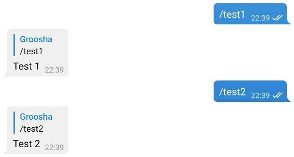
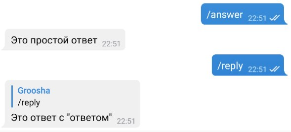

# Aiogram bilan tanishuv

## O'rnatish {: id="installation" }

Birinchi bo'lib bot uchun "папка" yaratamiz, va u erda virtual muhit (venv) ochib, aktivlashtiramiz va [aiogram](https://github.com/aiogram/aiogram) kutubxonasini o'rnatamiz.
Python 3.7 versiyasi o'rnatilganligini tekshirib ko'ramiz (agar sizda 3.8 yoki undan yuqori versiya o'rnatilganligini bilsangiz, bu qismni o'tkazib yuborishingiz mumkin):

```plain
[groosha@main lesson_01]$ python3.7
Python 3.7.6 (default, Apr 27 2020, 00:17:38)
[GCC 9.3.0] on linux
Type "help", "copyright", "credits" or "license" for more information.
>>> exit()
[groosha@main lesson_01]$
```

Endi `requirements.txt` faylini yaratib, foydalanayotgan aiogram versiyasini kiritamiz.
!!! important "Aiogram versiyalari haqida"
    Bu bobda aiogram **2.9.2** versiyasi qo‘llaniladi, lekin boshlashdan oldin kutubxonaning [relizlar kanalini](https://t.me/aiogram_live) ko‘rib chiqishingizni va yangiroq versiyasini tekshirishingizni tavsiya qilaman. 2 raqami bilan boshlanadigan har qanday relizni ishlatishingiz mumkin, chunki aiogram 3.0 kelajakda sezilarli o'zgarishlar bilan va 2.Xga mos kelmaydigan darajada chiqarilishi kutilmoqda.

```plain
[groosha@main lesson_01]$ python3.7 -m venv venv
[groosha@main lesson_01]$ echo "aiogram==2.9.2" > requirements.txt
[groosha@main lesson_01]$ source venv/bin/activate
(venv) [groosha@main lesson_01]$ pip install -r requirements.txt
# ...bu yerda installation haqida bir necha qatorlar...
Successfully installed Babel-2.8.0 aiogram-2.9.2 aiohttp-3.6.2 async-timeout-3.0.1 attrs-19.3.0 certifi-2020.6.20 chardet-3.0.4 idna-2.10 multidict-4.7.6 pytz-2020.1 typing-extensions-3.7.4.2 yarl-1.5.1
WARNING: You are using pip version 19.2.3, however version 20.2.1 is available.
You should consider upgrading via the 'pip install --upgrade pip' command.
(venv) [groosha@main lesson_01]$
```
Virtual muhitni aktivlashtirish:  
`source venv/bin/activate` - Linux Terminalda  
`venv\Scripts\activate` - Windows CMDda


Terminaldagi `venv` prefiksiga e'tibor bering. Bu bizning `venv` nomli virtual muhitida ekanligimizdan dalolat beradi.
Keling, venv ichida "python" buyrug'ini chaqiramiz (venv ichidagi python versiyasi ham global versiya bilan bir xil ekanligini ko'ramiz):

```plain
(venv) [groosha@main lesson_01]$ python
Python 3.7.6 (default, Apr 27 2020, 00:17:38)
[GCC 9.3.0] on linux
Type "help", "copyright", "credits" or "license" for more information.
>>> exit()
(venv) [groosha@main lesson_01]$ deactivate
[groosha@main lesson_01]$
```

Oxirgi `deactivate` buyrug'i bilan biz virtual muhitimizda chiqdik.

## Birinchi bot {: id="hello-world" }

Keling, basic aiogram bot shabloniga ega `bot.py` faylini yarataylik:

```python
#!venv/bin/python
import logging
from aiogram import Bot, Dispatcher, executor, types

# Bot obyekti
bot = Bot(token="12345678:AaBbCcDdEeFfGgHh")
# Bot dispetcheri
dp = Dispatcher(bot)
# Muhim xabarlarni loglarda o'tkazib yubormaslik uchun
logging.basicConfig(level=logging.INFO)


# /test1 buyrug'i uchun handler (ishlovchi, boshqaruvchi)
@dp.message_handler(commands="test1")
async def cmd_test1(message: types.Message):
    await message.reply("Test 1")


if __name__ == "__main__":
    # Botni ishga tushirish
    executor.start_polling(dp, skip_updates=True)
```

Shuni ta'kidlash kerakki, aiogram asinxron kutubxonadir, shuning uchun sizning funksiyalaringiz ham asinxron bo'lishi kerak, va API metodlariga qo'ng'iroq qilish (so'rov, chaqiruv)dan oldin siz **await** kalit so'zini qo'yishingiz kerak, chunki bu "qo'ng'iroq"lar [korutinalar](https://docs.python.org/3/library/asyncio-task.html#coroutines) qaytaradi.

!!! info "Pythonda asinxron dasturlash"
    Rasmiy "документация"larni e'tiborsiz qoldirmang!  
    [Python web-saytida](https://docs.python.org/3/library/asyncio-task.html) asyncio uchun qo'llanma mavjud.

Agar siz pyTelegramBotAPI kabi kutubxona bilan ishlagan bo'lsangiz, unda handler kontseptsiyasi sizga tanish, yagona farq shundaki, aiogramda handlerlar dispetcher tomonidan boshqariladi.  
Dispetcher handlerlar funksiyalarini ro'yxatdan o'tkazadi va ularni updatega qarab filtrlar orqali tartiblaydi mos kelmaydiganlarini ro'yxatdan olib tashlaydi. Qisqasi Telegramdan yangilanish (update) kelgach, qaysi handlerga borishi kerakligini tanlaydi.  
Filtrga misol: `"chat_id X va rasm caption uzunligi Y bo'lgan xabarlarni qayta ishlash"`.  

Agar ikkita handler, bir xil mantiqiy filtrlarga ega bo'lsa, ro'yxatdan birinchi o'tgani chaqiriladi.

Funksiyani handler sifatida ro'yxatdan o'tkazish uchun, ikki xil usul mavjud:

1. Yuqoridagi misolda bo'lgani kabi, unga [decorator](https://devpractice.ru/python-lesson-19-decorators/) biriktirish.
2. To'g'ridan-to'g'ri dispetcherda ro'yxatdan o'tkazish.

Quyidagi kodni ko'ring:

```python
# /test1 buyrug'i uchun decorator biriktirilgan handler
@dp.message_handler(commands="test1")
async def cmd_test1(message: types.Message):
    await message.reply("Test 1")

# /test2 buyrug'i uchun handler
async def cmd_test2(message: types.Message):
    await message.reply("Test 2")
```

Keling, ular bilan botni ishga tushiramiz:  


`/test2` buyrug'i uchun javobgar handler `cmd_test2` funksiyasi ishlamaydi, chunki dispetcher bu haqda bilmaydi. Keling, ushbu xatoni tuzatamiz va funksiyani ro'yxatdan o'tkazamiz:

```python
# /test2 buyrug'i uchun handler
async def cmd_test2(message: types.Message):
    await message.reply("Test 2")

# Boshqa joyda...
dp.register_message_handler(cmd_test2, commands="test2")
```

Botni qayta ishga turshuramiz:


## Istisnolar bilan ishlash {: id="error-handling" }

Exception = Istisno

Botning ishlashi davomida kod bilan emas, balki tashqi hodisalar bilan bog'liq bo'lgan turli xil xatolarning paydo bo'lishi muqarrar. Eng oddiy misol: botni bloklagan foydalanuvchiga xabar yuborishga urinish. Har bir metodni `try..except`ga tiqmaslik uchun aiogramda Bot API bilan bog'liq exceptionlar uchun maxsus handler mavjud.  
Quyidagi kodni ko'rib chiqing, u foydalanuvchiga javob berishdan oldin biroz uxlaydi:

```python
@dp.message_handler(commands="block")
async def cmd_block(message: types.Message):
    await asyncio.sleep(10.0)  # 10 soniya sog'lom uyqu
    await message.reply("Siz bloklandingiz.")
```

Ushbu 10 soniya davomida foydalanuvchi botni bloklash uchun vaqt topishi mumkin va `reply` metodi chaqirilganida `BotBlocked` exceptioniga olib keladi. Keling, ushbu exception uchun maxsus handler yozamiz:

```python
from aiogram.utils.exceptions import BotBlocked

@dp.errors_handler(exception=BotBlocked)
async def error_bot_blocked(update: types.Update, exception: BotBlocked):
    # Update: Telegramdan yangilanish obyekti. Exception: istisno obyekti

    # Bu yerda siz blockni boshqarishingiz mumkin,
    # masalan, foydalanuvchini bazadan o'chirish...
    print(f"Foydalanuvchi blokladi!\nXabar: {update}\nXatolik: {exception}")

    # Bunday handler har doim True qaytarishi kerak,
    # agar qo'shimcha nimadir qilish kerak bo'lmasa.
    return True
```

Bu handler boshqa handlerlarda yuzaga keladigan `BotBlocked` exceptionni bilan ishlaydi, natijada kod kamayadi, o'qilishi osonlashadi.

!!! warning "Muhim"
    Ammo xursandchiligimiz uzoqqa cho'zilmaydi, chunki `errors_handler`ning bir xususiyati borki, uni hamma Exceptionlarda ham foydalanish to'g'ri ish emas. Gap shundaki, exception uchun yozgan handleringiz ishga tushib va tugallangandan so'ng, boshqaruv asosiy xato yuzaga kelgan handlerga qaytmaydi. Oddiy qilib aytganda, agar, masalan, 100 ta siklning 57-iteratsiyasida `errors_handler`ni chaqirishiga to'g'ri kelsa (ya'ni exceptiion kelib chiqsa), qolgan iteratsiyalar va funksiyadagi kodning qolgan qismi bajarilmaydi. Bunday holatda, `try..except` ishlatishdan boshqa hech narsa qolmaydi.

## Sintaktik shakar {: id="sugar" }

Kodni yanada toza yozilishi va o'qilishi uchun aiogram standart Telegram metodlarining imkoniyatlarini kengaytirgan.
Masalan, `bot.send_message(...)` o'rniga `message.answer(...)` yoki `message.reply(...)` yozishingiz mumkin. Oxirgi ikki holatda `chat_id`ni ko'rsatish shart emas, u `updade`dan o'zi oladi. `answer` va `reply` o'rtasidagi farq oddiy:  
Birinchi metod shunchaki chatga xabar yuboradi, ikkinchisi xabarga javob qaytaradi:

```python
@dp.message_handler(commands="answer")
async def cmd_answer(message: types.Message):
    # bu xabar yuboradi
    await message.answer("Это простой ответ")


@dp.message_handler(commands="reply")
async def cmd_reply(message: types.Message):
    # bu xabarga javob qaytaradi
    await message.reply('Это ответ с "ответом"')
```



Bundan tashqari, ko'pgina xabar turlari uchun `answer_{type}` yoki `reply_{type}` kabi yordamchi metodlar mavjud, ya'ni `.answer_photo(...)` yoki `.reply_video(...)` masalan:

```python
@dp.message_handler(commands="dice")
async def cmd_dice(message: types.Message):
    await message.answer_dice(emoji="🎲")
```

!!! info "'message: types.Message' nimani anglatadi ?" 
    Python - [kuchli ammo dinamik turlanish](https://habr.com/ru/post/161205/)ga ega bo'lgan interpretor til, shuning uchun C++ yoki Javadagi kabi avvaldan ma'lum bir o'zgaruvchiga uni turini belgilab qo'yish mavjud emas. Biroq, 3.5-versiyadan boshlab, pythondagi variablelar turlariga ["hint(подсказка)"](https://docs.python.org/3/library/typing.html)lar berishni qo'llab-quvvatlashni boshladi, buning natijasida PyCharm kabi turli "checker" va IDElar variablelar turlarini tahlil qiladi va dasturchiga biror narsa noto'g'ri bo'lsa, xabar beradi.  
    Bizning holatda, `types.Message` hint(ko'rsatmasi) PyCharm’ga `message` o‘zgaruvchisi aiogram kutubxonasining `types` modulida aniqlanganidek `Message` turida ekanligini bildiradi (kod boshida importga qarang). Bu IDEga atributlar va funksiyalarni tezda taklif qilish imkonini beradi.

`/dice` buyrug'ini chaqirganda, bot o'sha chatga dice(🎲) yuboradi. Albatta, agar siz uni boshqa chatga yuborishingiz kerak bo‘lsa, eski uslubda `await bot.send_dice(...)`ga murojaat qilishingiz kerak bo‘ladi. Lekin `bot` obyekti (Bot classining ekzemplyari) ma'lum bir funksiyangiz bor modulda mavjud bo'lmasligi mumkin, ya'ni botingizni shabloniga asoslansak, `bot` obyekti ishga tushuruvchi fayldagina bo'ladi. Yaxshiyamki, bot obyekti barcha turdagi updatelarda mavjud: Message, CallbackQuery, InlineQuery va boshqalarda. Aytaylik, siz `/dice` buyrug'i yordamida 🎲ni suhbatlashiyotgan chatga emas, balki IDsi -100123456789 bo'lgan kanalga yubormoqchisiz. Oldingi funksiyani qayta yozamiz:

```python
@dp.message_handler(commands="dice")
async def cmd_dice(message: types.Message):
    await message.bot.send_dice(-100123456789, emoji="🎲")
```

Hammasi yaxshi, lekin agar siz to'satdan kodni kimdir bilan baham ko'rmoqchi bo'lsangiz, har safar bot tokenini koddan olib tashlashingiz kera, aks holda uni [@BotFather](https://t.me/botfather) bilan qayta `/revoke` qilishingizga to'g'ri keladi. Xavfsizlik uchun tokenni to'g'ridan-to'g'ri kodda ko'rsatishni to'xtataylik endi, uni [virtual-muhit o'zgaruvchisi](https://itproffi.ru/peremennye-okruzheniya-v-linux/) sifatida chiqaraylik.  
Fayl boshidagi quyidagi qatorlarni:

```python
import logging
from aiogram import Bot, Dispatcher, executor, types

bot = Bot(token="12345678:AaBbCcDdEeFfGgHh")
```

bunga almashtiring:

```python
import logging
from aiogram import Bot, Dispatcher, executor, types
from os import getenv
from sys import exit

bot_token = getenv("BOT_TOKEN")
if not bot_token:
    exit("Error: no token provided")

bot = Bot(token=bot_token)
```

Ammo endi sizning botingiz ishga tushmaydi. `Error: no token provided` bilan darhol ishini to'xtatadi.
PyCharmga virtual muhit o'zgaruvchisini kiritish uchun yuqoridagi Run -> Edit Configurations bo'limini oching va Environment Variables oynasiga BOT_TOKEN nomi va token qiymati bilan yangi o'zgaruvchini qo'shing.


Botni qayta ishga tushirib, ishlayotganiga kayf qiling. Kodni PyCharmda qo'rqmasdan [File Templates](https://www.jetbrains.com/help/pycharm/using-file-and-code-templates.html)da saqlash mumkin.

Kutubxona bilan tanishuvimizni shu yerda yakunlaymiz va keyingi boblarda aiogram va Telegram Bot APIning boshqa "features"larini ko‘rib chiqamiz.
